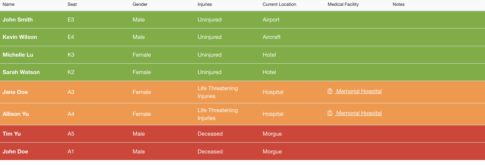
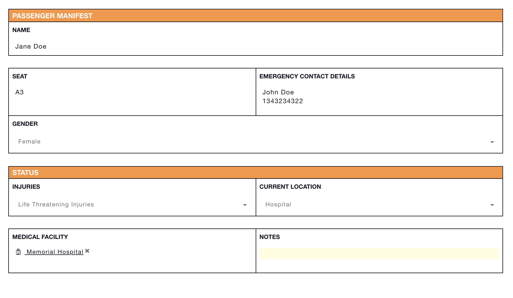

# Passenger Manifest


This article is part of [sample templates](../) for Incident Management


Use the Passenger Manifest status board to track injuries and fatalities during an incident. Record which hospitals your passengers are being treated. Write notes to capture any additional information you need.    
  
To upload this template into your account, follow the steps on our [Importing Sample Templates](../importing-sample-templates.md) page.






Copy the code below to add this template to your account


```text
{
  "name": "Passenger Manifest",
  "defaultColor": null,
  "nameLabel": "Name",
  "uniq_name": "passengers",
  "icon": "fa fa-child",
  "quickAdd": true,
  "suggestFromCollections": false,
  "layout": [
    {
      "type": "section",
      "rows": [
        {
          "type": "row",
          "items": [
            "seat",
            "emergency_contact"
          ]
        },
        {
          "type": "row",
          "items": [
            "gender"
          ]
        }
      ]
    },
    {
      "type": "section",
      "name": "Status",
      "rows": [
        {
          "type": "row",
          "items": [
            "status",
            "location"
          ]
        }
      ]
    },
    {
      "type": "section",
      "rows": [
        {
          "type": "row",
          "items": [
            "hospital",
            "notes"
          ]
        }
      ]
    }
  ],
  "fields": {
    "emergency_contact": {
      "label": "Emergency Contact Details",
      "type": "textarea"
    },
    "status": {
      "label": "Injuries",
      "type": "select",
      "options": [
        {
          "label": "Uninjured",
          "value": "uninjured"
        },
        {
          "label": "Minor Injuries",
          "value": "minor"
        },
        {
          "label": "Serious Injuries",
          "value": "serious"
        },
        {
          "label": "Life Threatening Injuries",
          "value": "life_threatening"
        },
        {
          "label": "Deceased",
          "value": "deceased"
        }
      ],
      "allowEmpty": true
    },
    "location": {
      "label": "Current Location",
      "type": "select",
      "options": [
        {
          "label": "Aircraft",
          "value": "aircraft"
        },
        {
          "label": "Hospital",
          "value": "hospital"
        },
        {
          "label": "Airport",
          "value": "airport"
        },
        {
          "label": "Passenger Holding",
          "value": "holding"
        },
        {
          "label": "Morgue",
          "value": "morgue"
        },
        {
          "label": "Hotel",
          "value": "hotel"
        }
      ],
      "allowEmpty": true
    },
    "seat": {
      "label": "Seat",
      "type": "text"
    },
    "hospital": {
      "label": "Medical Facility",
      "type": "relationship",
      "thisType": "info_item~passengers",
      "relName": "passengers2hospitals",
      "otherType": "info_item~hospitals"
    },
    "gender": {
      "label": "Gender",
      "type": "select",
      "options": [
        {
          "label": "Male",
          "value": "male"
        },
        {
          "value": "female",
          "label": "Female"
        }
      ],
      "allowEmpty": true
    },
    "notes": {
      "label": "Notes",
      "type": "text"
    }
  },
  "expressions": {
    "success": "!status || status===\"uninjured\"",
    "danger": "status===\"deceased\"",
    "warning": "status===\"life_threatening\" || status===\"serious\" || status===\"minor\""
  },
  "listLayout": {
    "row": [
      "seat",
      "gender",
      "status",
      "location",
      "hospital",
      "notes"
    ]
  },
  "headerProperties": [],
  "dashboardStats": [
    {
      "label": "Deceased",
      "value": "{{(items | pick: 'data.status === \\'deceased\\'').length }}",
      "dangerStatus": "(items | pick: 'data.status === \\'deceased\\'').length > 0"
    },
    {
      "label": "Life Threatening",
      "value": "{{(items | pick: 'data.status === \\'life_threatening\\'').length }}",
      "warningStatus": "(items | pick: 'data.status === \\'life_threatening\\'').length > 0"
    },
    {
      "label": "Minor",
      "value": "{{(items | pick: 'data.status === \\'minor\\'').length }}",
      "warningStatus": "(items | pick: 'data.status === \\'minor\\'').length > 0"
    },
    {
      "label": "Serious",
      "value": "{{(items | pick: 'data.status === \\'serious\\'').length }}",
      "warningStatus": "(items | pick: 'data.status === \\'serious\\'').length > 0"
    },
    {
      "label": "Uninjured",
      "value": "{{(items | pick: 'data.status === \\'uninjured\\'').length }}",
      "dangerStatus": "",
      "successStatus": "(items | pick: 'data.status === \\'uninjured\\'').length > 0"
    }
  ],
  "dashboardStatus": {
    "success": "(items | pick:'data.status===\\'\\'').length>0",
    "warning": "(items | pick:'data.status!=\\'\\'').length>0",
    "danger": "(items | pick:'data.status===\\'deceased\\'').length>0"
  },
  "defaultSortingProperty": "created_date",
  "defaultSortingOrder": "asc",
  "defaultShowOwnItemsOnly": false,
  "defaultShowArchived": false
}
```

