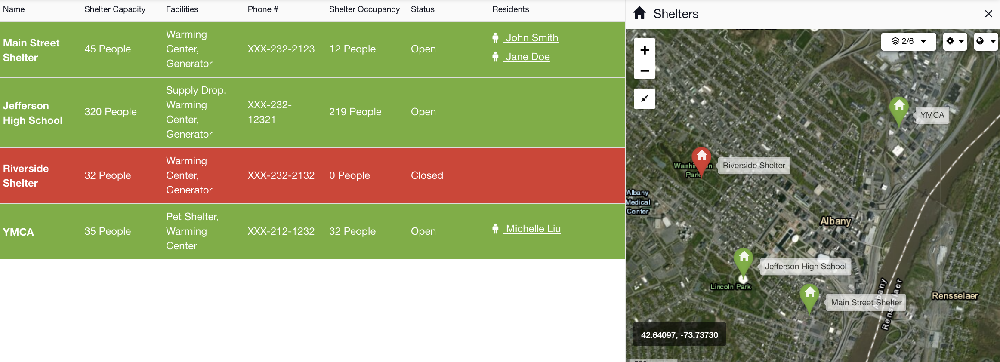
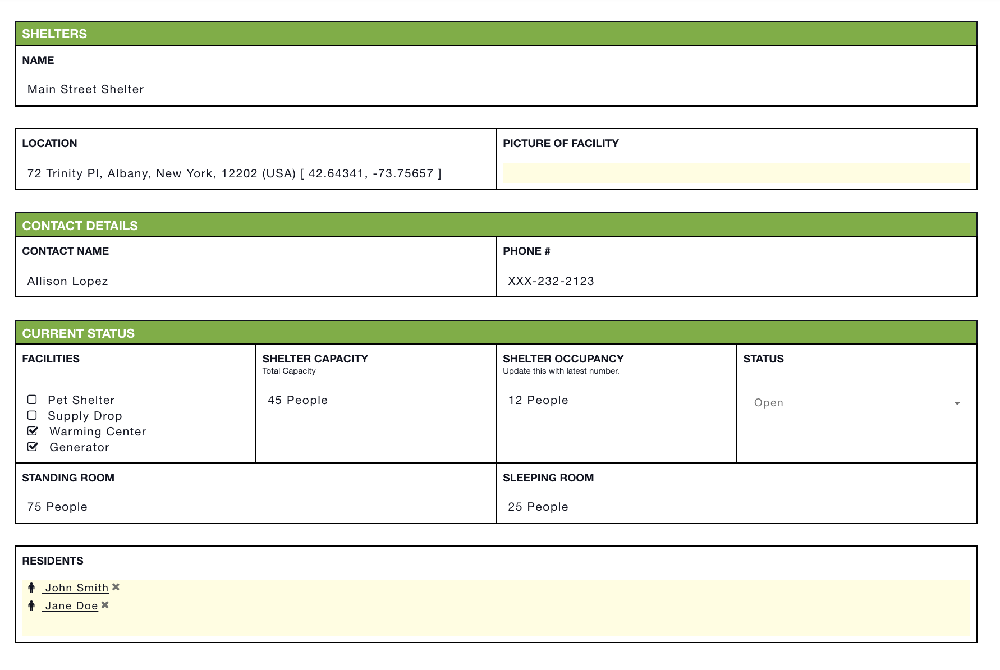

# Shelters


This article is part of [sample templates](../) for Incident Management


Use the Shelters status board to quickly view which shelters are at capacity and determine where to send your residents. View their contact details and what types of facilities they offer. Use the map tab to see where the shelters are located. Add the [Residents](residents.md) status board to your account as well in order to link your residents to specific shelters.   
  
To upload this template into your account, follow the steps on our [Importing Sample Templates](../importing-sample-templates.md) page.






Copy the code below to add this template to your account


```text
{
  "name": "Shelters",
  "defaultColor": null,
  "nameLabel": "Name",
  "uniq_name": "shelters",
  "icon": "glyphicon glyphicon-home",
  "quickAdd": true,
  "suggestFromCollections": false,
  "layout": [
    {
      "type": "section",
      "rows": [
        {
          "type": "row",
          "items": [
            "location",
            "picture_of_facility"
          ]
        }
      ]
    },
    {
      "type": "section",
      "rows": [
        {
          "type": "row",
          "items": [
            "contact_name",
            "phone"
          ]
        }
      ],
      "name": "Contact Details"
    },
    {
      "type": "section",
      "rows": [
        {
          "type": "row",
          "items": [
            "facilities",
            "shelter_capacity",
            "shelter_occupancy",
            "status"
          ]
        },
        {
          "type": "row",
          "items": [
            "standing_room",
            "sleeping_room"
          ]
        }
      ],
      "name": "Current Status"
    },
    {
      "type": "section",
      "rows": [
        {
          "type": "row",
          "items": [
            "residents"
          ]
        }
      ]
    }
  ],
  "fields": {
    "location": {
      "label": "Location",
      "type": "location"
    },
    "picture_of_facility": {
      "label": "Picture of Facility",
      "type": "file"
    },
    "contact_name": {
      "label": "Contact Name",
      "type": "text"
    },
    "phone": {
      "label": "Phone #",
      "type": "text"
    },
    "shelter_capacity": {
      "label": "Shelter Capacity",
      "type": "number",
      "hint": "Total Capacity",
      "postSymbol": "People"
    },
    "shelter_occupancy": {
      "label": "Shelter Occupancy",
      "type": "number",
      "hint": "Update this with latest number.",
      "postSymbol": "People"
    },
    "standing_room": {
      "label": "Standing Room",
      "type": "number",
      "postSymbol": "People"
    },
    "sleeping_room": {
      "label": "Sleeping Room",
      "type": "number",
      "postSymbol": "People"
    },
    "residents": {
      "label": "Residents",
      "type": "relationship",
      "thisType": "info_item~shelters",
      "relName": "residents2shelters",
      "otherType": "info_item~residents"
    },
    "status": {
      "label": "Status",
      "type": "select",
      "options": [
        {
          "label": "Open",
          "value": "open"
        },
        {
          "value": "closed",
          "label": "Closed"
        }
      ],
      "default": null
    },
    "facilities": {
      "label": "Facilities",
      "type": "checkbox",
      "options": [
        {
          "value": "pet_shelter",
          "label": "Pet Shelter"
        },
        {
          "value": "supply_drop",
          "label": "Supply Drop"
        },
        {
          "value": "warming_center",
          "label": "Warming Center"
        },
        {
          "label": "Generator",
          "value": "generator"
        }
      ]
    }
  },
  "expressions": {
    "success": "status === 'open'",
    "warning": "",
    "danger": "status === 'closed'"
  },
  "listLayout": {
    "row": [
      "shelter_capacity",
      "facilities",
      "phone",
      "shelter_occupancy",
      "status",
      "residents"
    ]
  },
  "defaultSortingProperty": "created_date",
  "defaultSortingOrder": "asc",
  "defaultShowOwnItemsOnly": false,
  "defaultShowArchived": false
}
```


