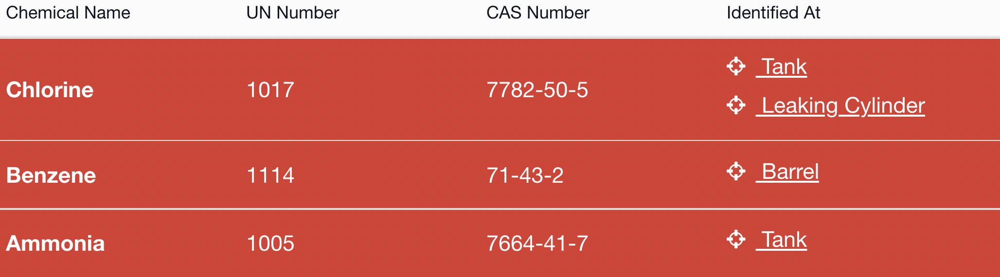
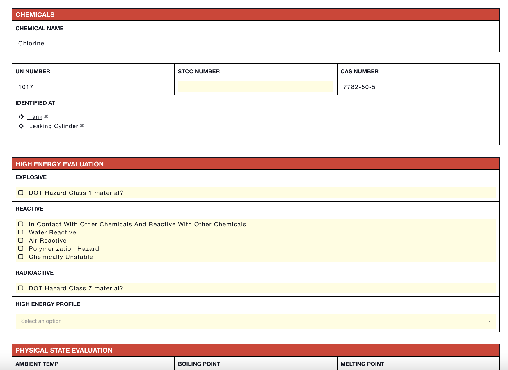

# Chemicals


This article is part of [sample templates](../) for Incident Management


Use the Chemicals status board to track information about the chemicals involved in the incident. Connect it to your [Targets](targets.md) status board to record the location of the chemicals. Use the form behind the status board to record information like special hazards, physical state evaluations, high energy evaluations, and risk assessments. 

To upload this template into your account, follow the steps on our [Importing Sample Templates](../importing-sample-templates.md) page.






Copy the code below to add this template to your account


```text
{
  "name": "Chemicals",
  "nameLabel": "Chemical Name",
  "uniq_name": "chemicals",
  "icon": "fa fa-flask",
  "quickAdd": true,
  "suggestFromCollections": false,
  "layout": [
    {
      "type": "section",
      "rows": [
        {
          "type": "row",
          "items": [
            "un_number",
            "stcc_number",
            "cas_number"
          ]
        },
        {
          "type": "row",
          "items": [
            "identified_at"
          ]
        }
      ],
      "name": ""
    },
    {
      "type": "section",
      "rows": [
        {
          "type": "row",
          "items": [
            "explosive"
          ]
        },
        {
          "type": "row",
          "items": [
            "reactive"
          ]
        },
        {
          "type": "row",
          "items": [
            "radioactive"
          ]
        },
        {
          "type": "row",
          "items": [
            "high_energy_profile"
          ]
        }
      ],
      "name": "HIGH ENERGY EVALUATION"
    },
    {
      "type": "section",
      "rows": [
        {
          "type": "row",
          "items": [
            "ambient_temp",
            "boiling_point",
            "melting_point"
          ]
        },
        {
          "type": "row",
          "items": [
            "evaluation"
          ]
        },
        {
          "type": "row",
          "items": [
            "liquid_gas"
          ]
        },
        {
          "type": "row",
          "items": [
            "liquid"
          ]
        },
        {
          "type": "row",
          "items": [
            "solid"
          ]
        }
      ],
      "name": "PHYSICAL STATE EVALUATION"
    },
    {
      "type": "section",
      "rows": [
        {
          "type": "row",
          "items": [
            "flash_point"
          ]
        },
        {
          "type": "row",
          "items": [
            "flammable"
          ]
        },
        {
          "type": "row",
          "items": [
            "ign_temp",
            "lel",
            "uel"
          ]
        },
        {
          "type": "row",
          "items": [
            "vapor_density"
          ]
        },
        {
          "type": "row",
          "items": [
            "rise"
          ]
        },
        {
          "type": "row",
          "items": [
            "sink"
          ]
        }
      ],
      "name": "EVALUATE GAS HAZARDS"
    },
    {
      "type": "section",
      "rows": [
        {
          "type": "row",
          "items": [
            "soluble_in_water"
          ]
        },
        {
          "type": "row",
          "items": [
            "floats"
          ]
        }
      ],
      "name": "EVALUATE LIQUID HAZARDS"
    },
    {
      "type": "section",
      "rows": [
        {
          "type": "row",
          "items": [
            "other_information"
          ]
        }
      ]
    }
  ],
  "fields": {
    "un_number": {
      "label": "UN Number",
      "type": "text"
    },
    "stcc_number": {
      "label": "STCC Number",
      "type": "text"
    },
    "cas_number": {
      "label": "CAS Number",
      "type": "text"
    },
    "explosive": {
      "label": "EXPLOSIVE",
      "type": "checkbox",
      "options": [
        {
          "label": "DOT Hazard Class 1 material?",
          "value": "dot_hazard_class_1_material"
        }
      ],
      "hint": "",
      "allowEmpty": true
    },
    "reactive": {
      "label": "REACTIVE",
      "type": "checkbox",
      "options": [
        {
          "label": "In Contact With Other Chemicals And Reactive With Other Chemicals",
          "value": "in_contact_with_other_chemicals_and_reactive_with_other_chemicals"
        },
        {
          "value": "water_reactive",
          "label": "Water Reactive"
        },
        {
          "value": "air_reactive",
          "label": "Air Reactive"
        },
        {
          "value": "polymerization_hazard",
          "label": "Polymerization Hazard"
        },
        {
          "value": "chemically_unstable",
          "label": "Chemically Unstable"
        }
      ],
      "hint": "",
      "allowEmpty": true
    },
    "high_energy_profile": {
      "label": "High Energy Profile",
      "type": "select",
      "options": [
        {
          "label": "Explosive",
          "value": "explosive"
        },
        {
          "value": "reactive",
          "label": "Reactive"
        },
        {
          "value": "radioactive",
          "label": "Radioactive"
        }
      ],
      "allowEmpty": true
    },
    "identified_at": {
      "label": "Identified At",
      "type": "relationship",
      "relName": "chemicals2targets",
      "thisType": "info_item~chemicals",
      "otherType": "info_item~targets"
    },
    "radioactive": {
      "label": "RADIOACTIVE",
      "type": "checkbox",
      "options": [
        {
          "label": "DOT Hazard Class 7 material?",
          "value": "dot_hazard_class_7_material"
        }
      ],
      "allowEmpty": true
    },
    "ambient_temp": {
      "label": "AMBIENT TEMP",
      "type": "text"
    },
    "boiling_point": {
      "label": "BOILING POINT",
      "type": "text"
    },
    "melting_point": {
      "label": "MELTING POINT",
      "type": "text"
    },
    "evaluation": {
      "label": "GAS",
      "type": "checkbox",
      "options": [
        {
          "label": "Boiling Point Below Ambient Temperature",
          "value": "boiling_point_below_ambient_temperature"
        }
      ]
    },
    "liquid_gas": {
      "label": "LIQUID / GAS",
      "type": "checkbox",
      "options": []
    },
    "liquid": {
      "label": "LIQUID",
      "type": "select",
      "options": [
        {
          "value": "boiling_point_above_300f",
          "label": "Boiling Point Above 300F"
        }
      ]
    },
    "solid": {
      "label": "SOLID",
      "type": "checkbox",
      "options": [
        {
          "label": "Melting Point Above Ambient Temperature",
          "value": "melting_point_above_ambient_temperature"
        }
      ]
    },
    "flash_point": {
      "label": "FLASH POINT",
      "type": "text"
    },
    "flammable": {
      "label": "FLAMMABLE",
      "type": "checkbox",
      "options": [
        {
          "label": "Below 100F",
          "value": "below_100f"
        }
      ]
    },
    "ign_temp": {
      "label": "IGN. TEMP",
      "type": "text"
    },
    "lel": {
      "label": "LEL",
      "type": "text"
    },
    "uel": {
      "label": "UEL",
      "type": "text"
    },
    "vapor_density": {
      "label": "VAPOR DENSITY",
      "type": "text"
    },
    "rise": {
      "label": "RISE",
      "type": "checkbox",
      "options": [
        {
          "label": "Below 1",
          "value": "below_1"
        }
      ]
    },
    "sink": {
      "label": "SINK",
      "type": "checkbox",
      "options": [
        {
          "label": "Above 1",
          "value": "above_1"
        }
      ]
    },
    "soluble_in_water": {
      "label": "SOLUBLE",
      "type": "checkbox",
      "options": [
        {
          "label": "Soluble In Water",
          "value": "soluble_in_water"
        }
      ]
    },
    "floats": {
      "label": "SPECIFIC GRAVITY",
      "type": "text"
    },
    "other_information": {
      "label": "Other Information",
      "type": "textarea"
    }
  },
  "expressions": {
    "success": "",
    "danger": "high_energy_profile!=''"
  },
  "listLayout": {
    "row": [
      "un_number",
      "cas_number",
      "identified_at"
    ]
  },
  "defaultSortingProperty": "created_date",
  "defaultSortingOrder": "asc",
  "defaultShowOwnItemsOnly": false,
  "defaultShowArchived": false
}
```

