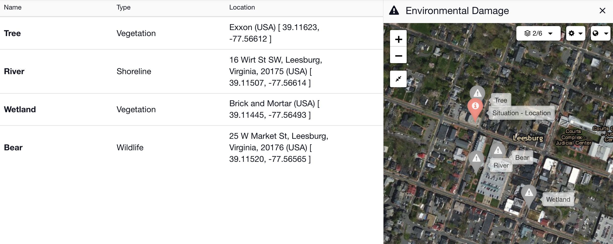
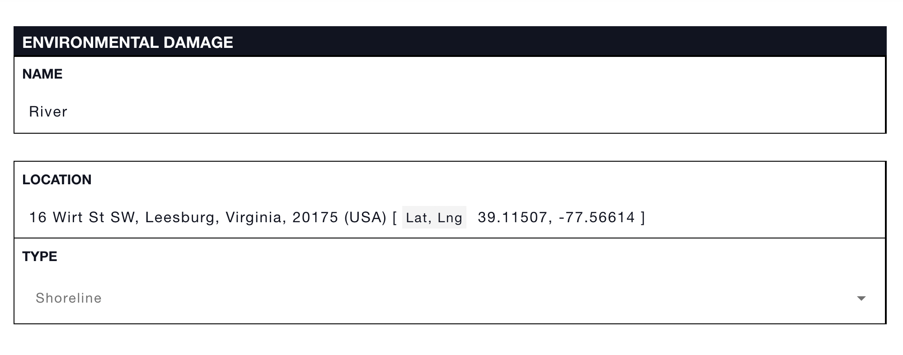

# Environmental Damage


This article is part of [sample templates](../) for Incident Management


Use the Environmental Damage status board template to add information about effected vegetation, shoreline, and wildlife. Record the location of the damage so it can be displayed on  the main map. Use the [form builder ](../../admin-area/templates/form-builder-and-field-types/)to create more fields for tracking additional details. 

To upload this template into your account, follow the steps on our [Importing Sample Templates](../importing-sample-templates.md) page.






Copy the code below to add this template to your account


```text
{
  "name": "Environmental Damage",
  "defaultColor": null,
  "nameLabel": "Name",
  "uniq_name": "environmental_damage",
  "icon": "fa fa-exclamation-triangle",
  "quickAdd": true,
  "suggestFromCollections": false,
  "layout": [
    {
      "type": "section",
      "rows": [
        {
          "type": "row",
          "items": [
            "location"
          ]
        },
        {
          "type": "row",
          "items": [
            "type"
          ]
        }
      ]
    }
  ],
  "fields": {
    "location": {
      "label": "Location",
      "type": "location"
    },
    "type": {
      "label": "Type",
      "type": "select",
      "options": [
        {
          "label": "Wildlife",
          "value": "wildlife"
        },
        {
          "value": "vegetation",
          "label": "Vegetation"
        },
        {
          "value": "shoreline",
          "label": "Shoreline"
        }
      ],
      "default": null,
      "allowEmpty": true
    }
  },
  "listLayout": {
    "row": [
      "type",
      "location"
    ]
  },
  "defaultSortingProperty": "created_date",
  "defaultSortingOrder": "asc",
  "defaultShowOwnItemsOnly": false,
  "defaultShowArchived": false
}
```

