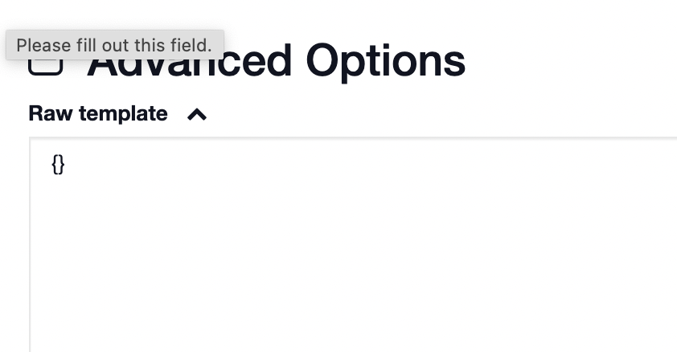
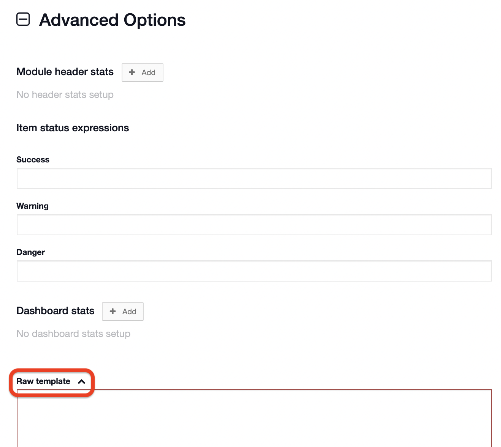

# Importing Sample Templates

Once you have identified a [status board](/incident-management-status-boards/status-boards) or [form](/d4h-incident-management/forms) from our raw template collection that matches your team’s requirements, the following guide will walk you through adding it to your account. Depending on whether it is a form or a status board, the process will be slightly different. For both processes, start by going to the [Admin Area](/d4h-incident-management/admin-area). To access the Admin Area, click the green⇅in the upper right corner of your [Incident Management](/d4h-incident-management/incident-management) account. 


If you do not see the arrows, you do not have the permission level necessary to access the Admin Area. Only Account Owners can access the Admin Area.


## Adding a Form 

To import a form into your account:

* Go to the **Admin Area** &gt; **Templates**
* Select Forms and click on **New form template**
* Expand ➕ **Advanced Options** at the bottom of the page
* Remove all text from the raw template box, it must be empty
* You can now paste your code from one of our sample templates into the **Raw template** area
* Click **Save**
* The template will now be available for you to use in your [channels](../channels/)

## Adding a Status Board

To import a status board into your account:

* Go to the **Admin Area** &gt; **Templates**
* Select Status Boards and click on **New Status Board**
* Expand ➕ **Advanced Options** at the bottom of the page
* Remove all text from the raw template box, it must be empty
* You can now paste your code from one of our sample templates into the **Raw template** area
* Click **Save**
* The template will now be available for you to use in your channels


Use the same steps for [Task Board](../task-boards/) templates but select **Task** during the second step instead of Status Board.


## Customization

After importing a status board or form, they are ready to be used in any of your channels. However, you may want to have it customized for your team first. Since it is a template, you are able to edit any of the forms and status board configurations as you see fit. Remember, these templates are meant to help inspire you. You can change them, or not change them, as much as you want. Since you have a copy of the raw template, you can return it to the original template at any time by copying and pasting the old code over the new. 


Ideas for possible edits

* changing names and terminology
* adjusting colors and symbols
* linking fields using [relationships](../admin-area/templates/form-builder-and-field-types/)
* adding additional fields you want to track


## Sharing Your Own Templates

Do you have templates of your own that you want to share with the Bravo Zulu community? Contact [support@d4h.org](mailto:support@d4h.org) to learn more about how to share.   

