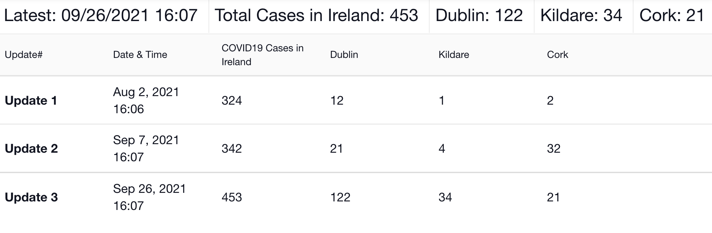
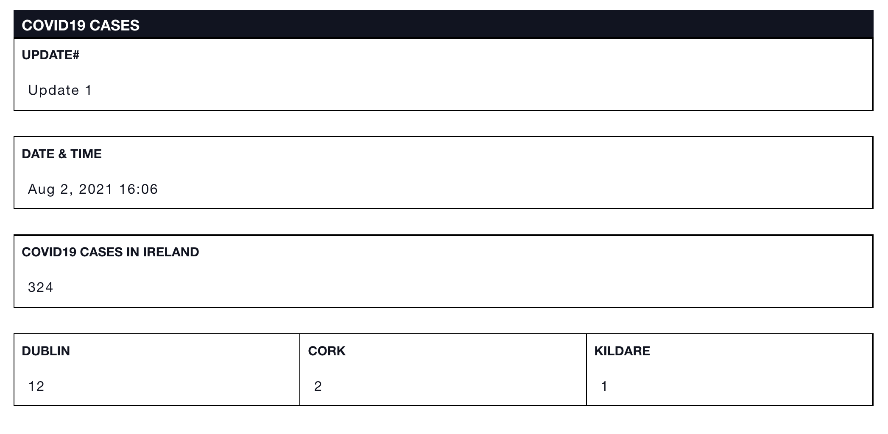

# Cases


This article is part of [sample templates](../) for Incident Management


Use the Cases status board to track outbreaks in different parts of your region. Rename the locations in the status board to make it applicable to your area. Track the total number of cases in the region as well as within subregions. See the most recent update displayed at the top of the screen to quickly access the latest numbers.  

To upload this template into your account, follow the steps on our [Importing Sample Templates](../importing-sample-templates.md) page.






Copy the code below to add this template to your account


```text
{
  "name": "Cases",
  "defaultColor": null,
  "nameLabel": "Update#",
  "nameTemplate": "Update {counter}",
  "uniq_name": "covid19_cases",
  "icon": "fa fa-plus-circle",
  "quickAdd": false,
  "suggestFromCollections": false,
  "layout": [
    {
      "type": "section",
      "rows": [
        {
          "type": "row",
          "items": [
            "date_and_time"
          ]
        }
      ]
    },
    {
      "type": "section",
      "rows": [
        {
          "type": "row",
          "items": [
            "covid19_cases"
          ]
        }
      ]
    },
    {
      "type": "section",
      "rows": [
        {
          "type": "row",
          "items": [
            "dublin",
            "cork",
            "kildare"
          ]
        }
      ]
    }
  ],
  "fields": {
    "covid19_cases": {
      "label": "COVID19 Cases in Ireland",
      "type": "number"
    },
    "dublin": {
      "label": "Dublin",
      "type": "number"
    },
    "cork": {
      "label": "Cork",
      "type": "number"
    },
    "date_and_time": {
      "label": "Date & Time",
      "type": "datetime"
    },
    "kildare": {
      "label": "Kildare",
      "type": "number"
    }
  },
  "expressions": {
    "success": "",
    "warning": "",
    "danger": ""
  },
  "listLayout": {
    "row": [
      "date_and_time",
      "covid19_cases",
      "dublin",
      "kildare",
      "cork"
    ]
  },
  "headerProperties": [
    "Latest: {{items  | pick:'data.date_and_time != null' | max:'data.date_and_time' | getProp:'data.date_and_time' | displayDate:{showTime:true,shortFormat:true} }}",
    "Total Cases in Ireland: {{items | pick:'data.date_and_time != null' | max:'data.date_and_time' | getProp:'data.covid19_cases'}}",
    "Dublin: {{items | pick:'data.date_and_time != null' | max:'data.date_and_time' | getProp:'data.dublin'}}",
    "Kildare: {{items | pick:'data.date_and_time != null' | max:'data.date_and_time' | getProp:'data.kildare'}}",
    "Cork: {{items | pick:'data.date_and_time != null' | max:'data.date_and_time' | getProp:'data.cork'}}"
  ],
  "dashboardStats": [
    {
      "label": "",
      "value": ""
    }
  ],
  "defaultSortingProperty": "created_date",
  "defaultSortingOrder": "asc",
  "defaultShowOwnItemsOnly": false,
  "defaultShowArchived": false
}

```


