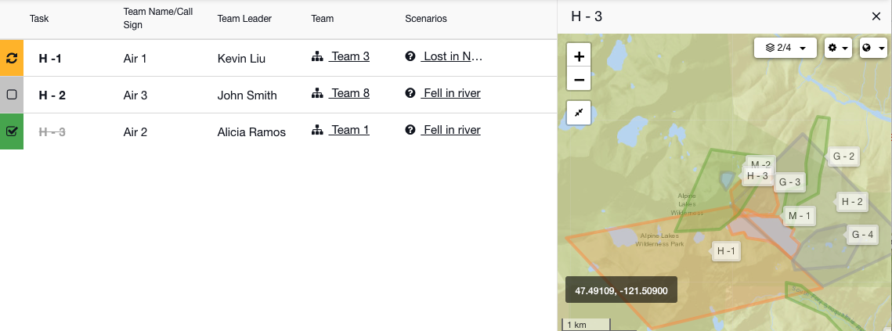
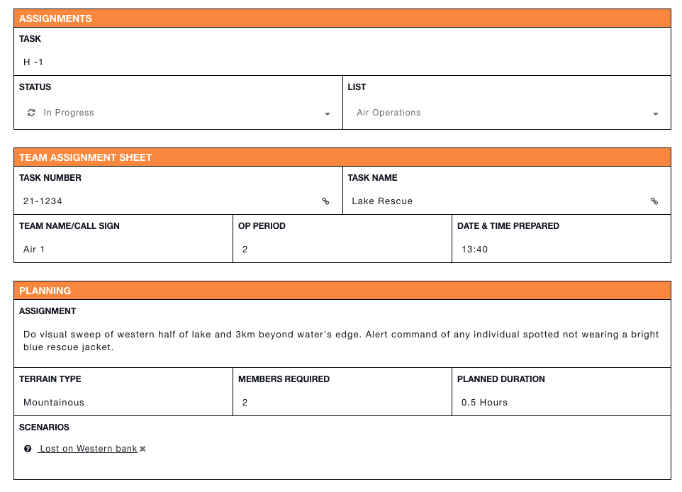

# Assignments

This article is part of [sample templates](../) for Incident Management

Use the Assignments task template to track your search areas. Organize the assignments into lists and monitor the overall progress. Have your team leaders mark their assignments as not started, in-progress, or completed. Connect your assignments to proposed [scenarios.](scenarios.md) The customizable form allows you to record any pertinent information your teams need to know and share it will them in real time.   
  
To upload this template into your account, follow the steps on our [Importing Sample Templates](../importing-sample-templates.md) page. Be careful to save this particular template under task templates and not status boards. 






## Raw Template

```text
{
  "uniq_name": "team_assignments",
  "name": "Assignments",
  "nameLabel": "Task",
  "icon": "fa fa-sign-out",
  "quickAdd": false,
  "statusList": [
    {
      "label": "Not Started",
      "phase": "initial",
      "icon": "fa fa-square-o",
      "value": "not_started"
    },
    {
      "label": "In Progress",
      "phase": "progress",
      "icon": "fa fa-refresh",
      "value": "in_progress"
    },
    {
      "label": "Complete",
      "phase": "complete",
      "icon": "fa fa-check-square-o",
      "value": "complete"
    },
    {
      "icon": "glyphicon glyphicon-zoom-in",
      "phase": "complete",
      "value": "debriefed",
      "label": "Debriefed"
    }
  ],
  "defaultStatus": "not_started",
  "layout": [
    {
      "type": "section",
      "rows": [
        {
          "type": "row",
          "items": [
            "task_number",
            "task_name"
          ]
        },
        {
          "type": "row",
          "items": [
            "team_name_call_sign",
            "op_period",
            "date_and_time_prepared"
          ]
        }
      ],
      "name": "Team Assignment Sheet"
    },
    {
      "type": "section",
      "rows": [
        {
          "type": "row",
          "items": [
            "assignment"
          ]
        },
        {
          "type": "row",
          "items": [
            "terrain_type",
            "members_required",
            "planned_duration"
          ]
        },
        {
          "type": "row",
          "items": [
            "scenario"
          ]
        }
      ],
      "name": "PLANNING"
    },
    {
      "type": "section",
      "rows": [
        {
          "type": "row",
          "items": [
            "risk_rating",
            "risk_assessment_done"
          ]
        }
      ],
      "name": "RADeMS"
    },
    {
      "type": "section",
      "rows": [
        {
          "type": "row",
          "items": [
            "briefing_checklist",
            "special_equipment"
          ]
        },
        {
          "type": "row",
          "items": [
            "team",
            "transportation"
          ]
        },
        {
          "type": "row",
          "items": [
            "team_leader"
          ]
        },
        {
          "type": "row",
          "items": [
            "team_members"
          ]
        }
      ],
      "name": "OPERATIONS"
    },
    {
      "type": "section",
      "rows": [
        {
          "type": "row",
          "items": [
            "map_point"
          ]
        },
        {
          "type": "row",
          "items": [
            "map_area"
          ]
        },
        {
          "type": "row",
          "items": [
            "file"
          ]
        }
      ],
      "name": "Map"
    },
    {
      "type": "section",
      "rows": [
        {
          "type": "row",
          "items": [
            "debriefing"
          ]
        },
        {
          "type": "row",
          "items": [
            "clues"
          ]
        },
        {
          "type": "row",
          "items": [
            "difficulties_gaps_and_problems"
          ]
        },
        {
          "type": "row",
          "items": [
            "hazards_and_dangers"
          ]
        },
        {
          "type": "row",
          "items": [
            "comments_and_suggestions"
          ]
        },
        {
          "type": "row",
          "items": [
            "debriefed_by"
          ]
        }
      ],
      "name": "ASSIGNMENT DEBRIEFING"
    }
  ],
  "fields": {
    "task_number": {
      "label": "Task Number",
      "type": "text",
      "linkedTo": "situation.data.report_from"
    },
    "task_name": {
      "label": "Task Name",
      "type": "text",
      "linkedTo": "situation.name"
    },
    "team_name_call_sign": {
      "label": "Team Name/Call Sign",
      "type": "text"
    },
    "op_period": {
      "label": "Op Period",
      "type": "number"
    },
    "date_and_time_prepared": {
      "label": "Date & Time Prepared",
      "type": "datetime"
    },
    "assignment": {
      "label": "Assignment",
      "type": "textarea"
    },
    "terrain_type": {
      "label": "Terrain Type",
      "type": "text"
    },
    "members_required": {
      "label": "Members Required",
      "type": "number"
    },
    "planned_duration": {
      "label": "Planned Duration",
      "type": "number",
      "postSymbol": "Hours"
    },
    "briefing_checklist": {
      "label": "Briefing Checklist",
      "type": "checkbox",
      "options": [
        {
          "label": "Situation",
          "value": "situation"
        },
        {
          "value": "mission",
          "label": "Mission"
        },
        {
          "value": "execution",
          "label": "Execution"
        },
        {
          "value": "administration",
          "label": "Administration"
        },
        {
          "value": "communications",
          "label": "Communications"
        }
      ]
    },
    "special_equipment": {
      "label": "Special Equipment",
      "type": "textarea"
    },
    "transportation": {
      "label": "Transportation",
      "type": "textarea"
    },
    "team_leader": {
      "label": "Team Leader",
      "type": "text",
      "thisType": "task~team_assignments",
      "otherType": "personnel",
      "relName": "tl"
    },
    "team_members": {
      "label": "Team Members",
      "type": "table",
      "fields": {
        "name": {
          "label": "Name",
          "type": "text"
        },
        "position": {
          "label": "Position",
          "type": "text"
        },
        "group_agency": {
          "label": "Group/Agency",
          "type": "text"
        },
        "phone_number": {
          "label": "Phone Number",
          "type": "text"
        },
        "training_and_skills": {
          "label": "Training & Skills",
          "type": "text"
        }
      },
      "layout": {
        "columns": [
          "name",
          "position",
          "group_agency",
          "phone_number",
          "training_and_skills"
        ]
      }
    },
    "debriefing": {
      "label": "Debriefing",
      "type": "textarea",
      "hint": "Explain what your team actually did and any comments"
    },
    "clues": {
      "label": "Clues",
      "type": "textarea"
    },
    "difficulties_gaps_and_problems": {
      "label": "Difficulties, Gaps & Problems",
      "type": "textarea"
    },
    "hazards_and_dangers": {
      "label": "Hazards & Dangers",
      "type": "text"
    },
    "comments_and_suggestions": {
      "label": "Comments & Suggestions",
      "type": "text"
    },
    "debriefed_by": {
      "label": "Debriefed By",
      "type": "signature",
      "thisType": "task~team_assignments",
      "otherType": "personnel",
      "relName": "operationsdebrief"
    },
    "map_point": {
      "label": "Map Point",
      "type": "location"
    },
    "map_area": {
      "label": "Map Area",
      "type": "mapArea"
    },
    "file": {
      "label": "File",
      "type": "file",
      "multiple": true
    },
    "scenario": {
      "label": "Scenarios",
      "type": "relationship",
      "thisType": "task~team_assignments",
      "relName": "scenarios2assignments",
      "otherType": "info_item~scenarios"
    },
    "team": {
      "label": "Team",
      "type": "relationship",
      "thisType": "task~team_assignments",
      "relName": "assignments2roles",
      "otherType": "personnel_role"
    },
    "risk_rating": {
      "label": "Risk Rating",
      "type": "number"
    },
    "risk_assessment_done": {
      "label": "Risk Assessment Done",
      "type": "select",
      "options": [
        {
          "label": "Yes",
          "value": "yes"
        },
        {
          "value": "no",
          "label": "No"
        }
      ],
      "default": "no"
    }
  },
  "listLayout": {
    "row": [
      "team_name_call_sign",
      "team_leader",
      "team",
      "scenario"
    ]
  }
}
```

