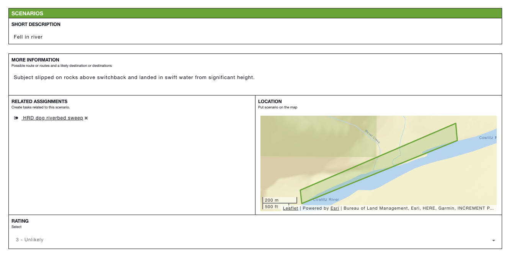

# Scenarios


This article is part of [sample templates](../) for Incident Management


Use the Scenarios template to anticipate possible locations and situations for missing people and corresponding tactics. Rate each scenario according to its likelihood and create related assignments that would locate the subject in the proposed scenario. Quickly view the areas the scenarios relate to by using the location map.  
  
To upload this template into your account, follow the steps on our [Importing Sample Templates](../importing-sample-templates.md) page.




## Raw Template

```text
{
  "name": "Scenarios",
  "defaultColor": null,
  "nameLabel": "Short Description",
  "uniq_name": "scenarios",
  "icon": "fa fa-question-circle",
  "quickAdd": false,
  "layout": [
    {
      "type": "section",
      "rows": [
        {
          "type": "row",
          "items": [
            "description"
          ]
        },
        {
          "type": "row",
          "items": [
            "search_tasks",
            "location"
          ]
        },
        {
          "type": "row",
          "items": [
            "priority"
          ]
        }
      ]
    }
  ],
  "fields": {
    "priority": {
      "label": "Rating",
      "type": "select",
      "hint": "Select",
      "options": [
        {
          "label": "1 - Very Likely",
          "value": "1"
        },
        {
          "value": "2",
          "label": "2 - Likely"
        },
        {
          "value": "3",
          "label": "3 - Unlikely"
        },
        {
          "value": "4",
          "label": "4 - Very Unlikely"
        }
      ],
      "default": null
    },
    "description": {
      "label": "More Information",
      "type": "textarea",
      "hint": "Possible route or routes and a likely destination or destinations"
    },
    "search_tasks": {
      "label": "Related Assignments",
      "type": "relationship",
      "relName": "scenarios2assignments",
      "thisType": "info_item~scenarios",
      "otherType": "task~team_assignments",
      "hint": "Create tasks related to this scenario."
    },
    "location": {
      "label": "Location",
      "type": "mapArea",
      "hint": "Put scenario on the map"
    }
  },
  "expressions": {
    "danger": "priority==1",
    "warning": "priority==2",
    "success": "priority==4 || priority==3"
  },
  "listLayout": {
    "row": [
      "description",
      "search_tasks",
      "priority",
      "location"
    ]
  }
}
```

