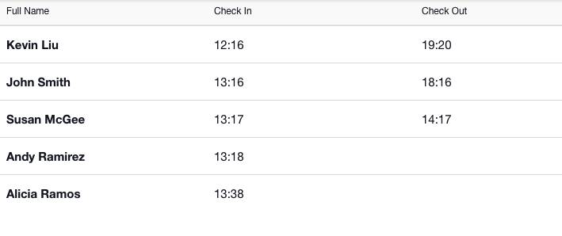
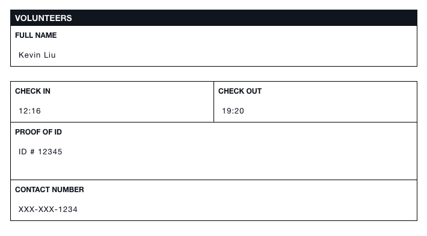

# Volunteers


This article is part of [sample templates](../) for Incident Management


Use the Volunteers template to track your responders. Record their check in and check out times. Quickly access their contact information proof of ID. These templates are customizable, so use it as a starting point to create your own roster with any additional information desired.   
  
To upload this template into your account, follow the steps on our [Importing Sample Templates](../importing-sample-templates.md) page.





## Raw Template

```text
{
  "name": "Volunteers",
  "defaultColor": null,
  "nameLabel": "Full Name",
  "uniq_name": "volunteers",
  "icon": "fa fa-group",
  "quickAdd": false,
  "layout": [
    {
      "type": "section",
      "rows": [
        {
          "type": "row",
          "items": [
            "check_in",
            "check_out"
          ]
        },
        {
          "type": "row",
          "items": [
            "proof_of_id"
          ]
        },
        {
          "type": "row",
          "items": [
            "contact_number"
          ]
        }
      ]
    }
  ],
  "fields": {
    "contact_number": {
      "label": "Contact Number",
      "type": "text"
    },
    "check_in": {
      "label": "Check In",
      "type": "datetime"
    },
    "check_out": {
      "label": "Check Out",
      "type": "datetime"
    },
    "proof_of_id": {
      "label": "Proof of ID",
      "type": "textarea"
    }
  },
  "listLayout": {
    "row": [
      "check_in",
      "check_out"
    ]
  }
}
```

