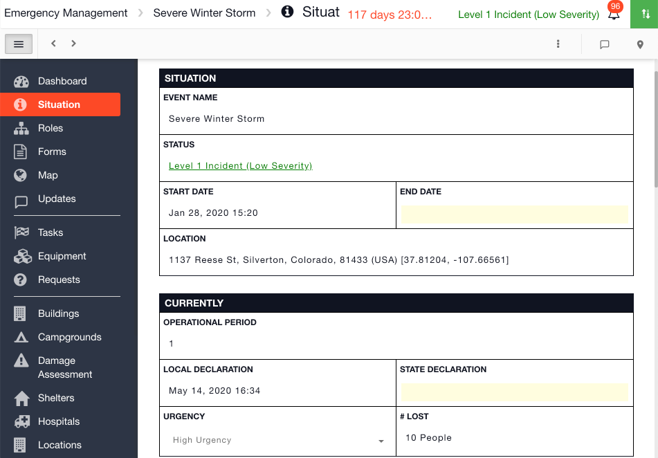
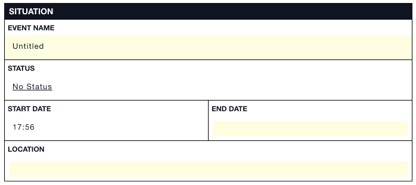

# Situation

The Situation provides the latest updates on an event / incident.\
\
You can configure your Situation form in the [Admin Area ](../admin-area/)under Templates. You can also change the name of your Situation form by typing in the name field at the top of the template. Incident Summary, SITREP, and Incident Report are all common alternate names. \
\
The first 5 fields in the Situation Report (SITREP) are built in.

* **Event name**: this is the name of the event / incident that you type in when you start a new channel, e.g. Chemical Spill, Severe Winter Storm, Passenger Incident, Air Monitoring, Pipeline Incident etc. 
* **Status**: you can configure the statuses in the Admin Area
* **Start Date**: the clock / timer in your channel is based on this time and date. The system autofills this field when you open the channel
* **End Date**: the clock / timer in your channel will stop when this field has been filled in
* **Location**: the location set here is pinned to the map, and is also the location where the weather is recorded for the [Weather](../weather.md) module \

## Templates

There will only be one Situation Report template in your Incident Management account and this will be the form visible in all channels. The Template outlines the layout of the form behind it.


[form-builder-and-field-types](../admin-area/templates/form-builder-and-field-types/)



[pinning-a-field-to-the-dashboard.md](../dashboard/pinning-a-field-to-the-dashboard.md)



[linking-fields-to-the-situation.md](linking-fields-to-the-situation.md)



[show-or-hide-a-form-section-based-on-the-value-of-a-field-option.md](../admin-area/templates/form-builder-and-field-types/show-or-hide-a-form-section-based-on-the-value-of-a-field-option.md)


## Using the Situation Report

When you start a new channel, the first thing you will start filling out is the Situation Report.


[configuring-the-channel-statuses.md](../channels/configuring-the-channel-statuses.md)



[taking-a-snapshot.md](taking-a-snapshot.md)



[displaying-the-situation-on-the-map.md](../map/displaying-the-situation-on-the-map.md)



[tagging-the-situation-in-the-log.md](tagging-the-situation-in-the-log.md)



[printing-to-pdf.md](printing-to-pdf.md)



[sharing-by-email-and-public-link.md](sharing-by-email-and-public-link.md)



[viewing-the-audit-trail.md](viewing-the-audit-trail.md)


