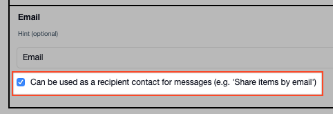
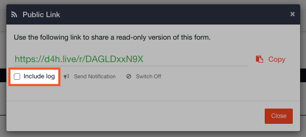

# Sharing by Email and Public Link

#### WEB APP

In your [Incident Management](../getting-started.md) account everything can be shared externally by email and all forms can be shared by a public link. 

## Share by Email

To share the screen you are on:

* Click on **More Options \[⋮\]**
* Click on **Share by email...**
* Select the recipients you want the system to send the email to. 
* Click **Next**
* Customize your subject and message and press **Send**


All personnel who have been added to the Channel will appear as potential recipients but you can add additional recipient lists by adding an Email type field to the template of a Status Board and checking 'Can be used as a recipient contact' underneath it. All emails added to that Status Board will appear in a recipient list by the name of the board.


## Share by Public Link

Our public links allow you to make the content of [Task Boards](../task-boards/) and [Forms](../forms/) \(including the forms behind [Status Boards](../status-boards/)\) accessible to those without credentials to your account. The link generated is 'secret' in such that it is too complex to guess and cannot be found by browsing or searching the internet.

* Click on **More Options \[⋮\]**
* Select **Share by public link...**
* We will generate a 'secret link' that you can share externally
* You can choose to include log posts when sharing the link

You can switch off a Public Link at any time by following the same steps. All links are disabled when you Shut Down the channel.




This is a great way to share a form with the wider organization or to another agency such as law enforcement. 


