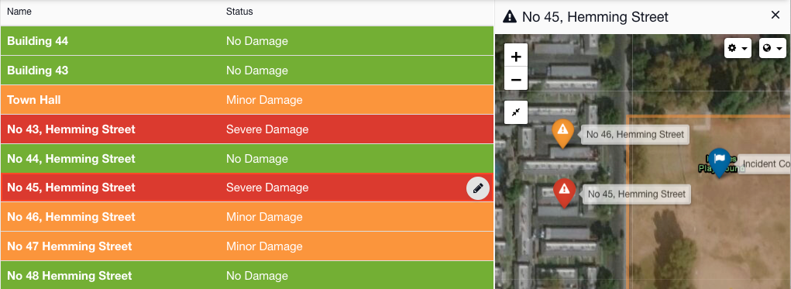

# Status Boards

A Status Board is a visualization of information within [Incident Management](../getting-started.md). It is comprised of a set of rows, much like a spreadsheet, with a configurable form behind each row.  
  
You can add as many Status Boards as you like. Here's some examples you could create in your account.=


**Ideas for your Status Boards:** There is no limit as to what you can represent in a status board. Here are some ideas from other customers to get you started. 

* Shelters
* Risks
* Rivers
* Roads
* Bridges
* Buildings
* Damage Assessments
* Schools
* Infections
* Crew
* Passengers
* Delays
* Incidents 


Data in a Status Board can be sorted and grouped, while rules can be designed to change the colour of each row, update dashboard widgets, and module headers.  
  
Opening the [Map](../map/) on the side-bar will display information about the Status Board while opening the [Updates ](../updates/)on the side-bar will allow you to see any posts relevant to what you're viewing.  
  
Each Status Board is designed by creating a [Template](../templates/). [Collections](../collections/) can be used to pre-load items into it during an event.

## Templates

Each Status Board has a [Template](../templates/) which outlines the layout of the form behind it and which columns should display on the list view.















## Collections

[Collections](../collections/) are used to pre-load data into a Status Board. For example you might have a Status Board of 'Shelters' and you could enter all the county storm shelters in to the collections in advance. They are then available pre-loaded to import during an Incident







## Using Status Boards

When you come to use a Status Board during an event, you should first add it to your channel or start your channel with a [Play ](../plays/)that includes it.





























