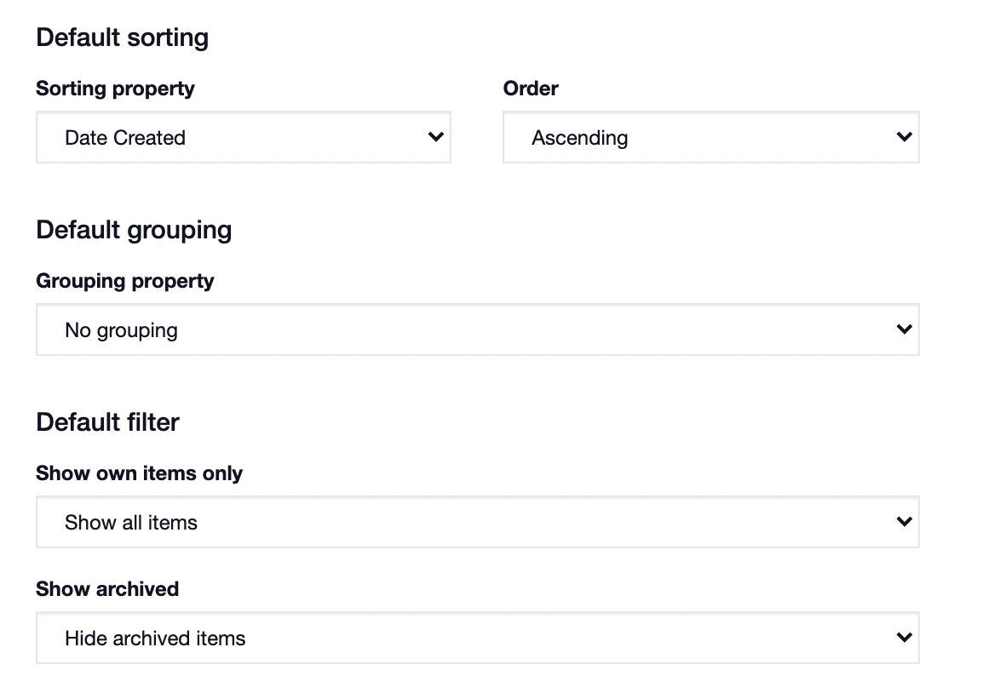

# Filtering a Status Board

#### WEB APP

You can filter a status board so that it displays only the items that have been assigned to you, your role or your team. In the [status board](./):

* Click the **filter** icon
* Click **My Items**
* Now only your items and your teams items are showing



You can also predetermine filtering settings in the Admin Area. To do this:

* Go to the **Admin Area**
* Go to **Templates**
* Select **Status Boards** and chose the status board you want to modify
* Scroll down to **List View Settings**
* Set your default filtering options

