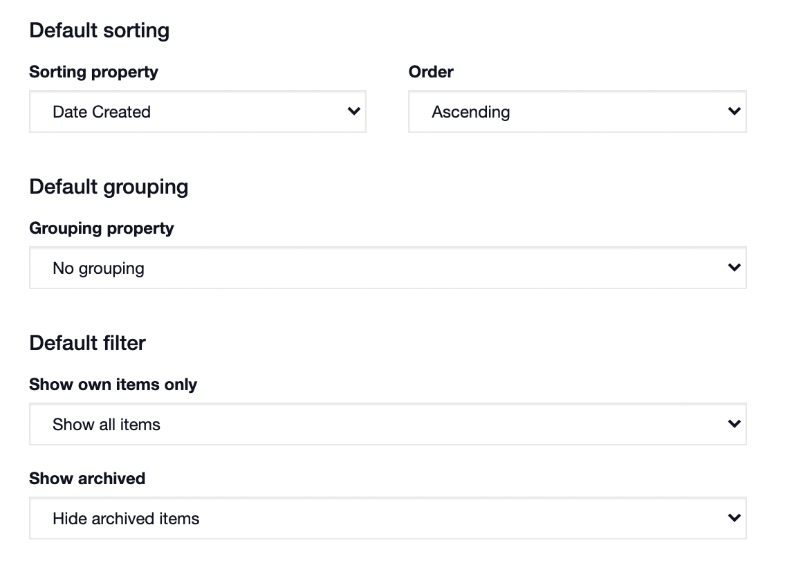

# Grouping and Sorting Rows

#### WEB APP

You have the option of predetermining how to group and sort your rows for [Status Boards](./). To do this:

* Go to the **Admin Area**
* Go to **Templates**
* Select **Status Boards** and chose the status board you want to modify
* Scroll down to **List View Settings** 
* Set your default sorting and grouping

To group the rows in a Status Board from the board itself, follow the below steps.

* Click on **More Options \[⋮\]**
* Click on **Group by**
* Choose what you would like to group by from the menu

To sort the rows in a Status Board from the board itself, follow these steps.

* Click on **More Options \[⋮\]**
* Click on **Sort by**
* Choose what you would like to sort them by from the menu



