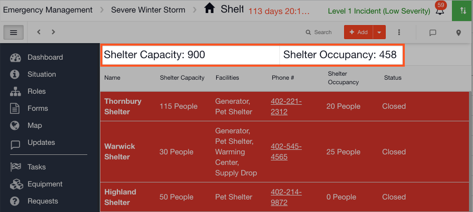
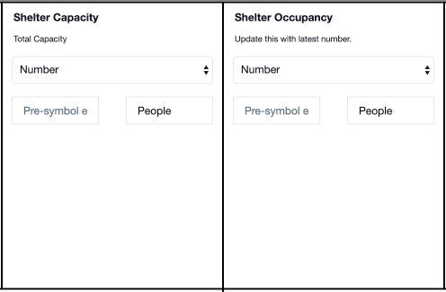
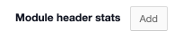
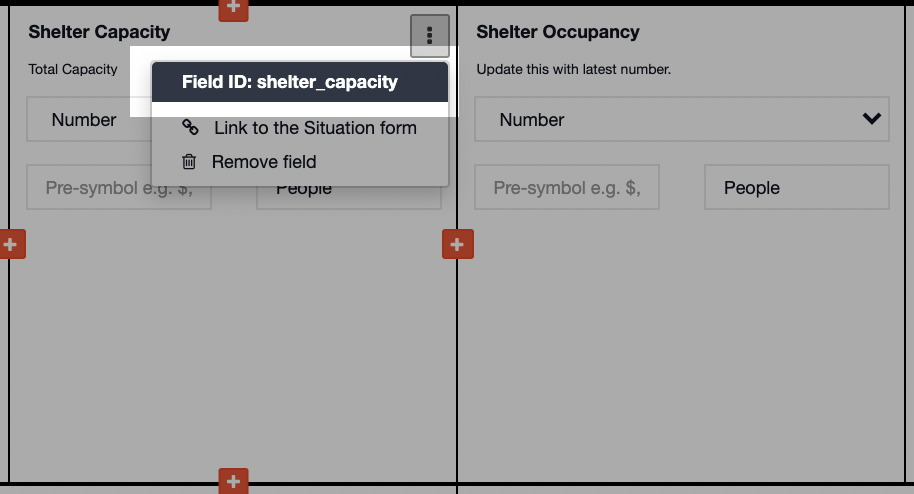
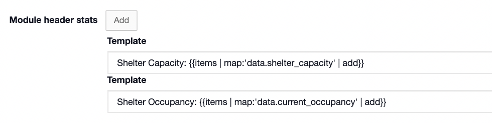
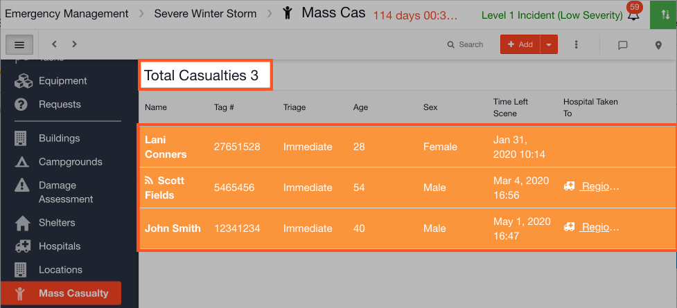
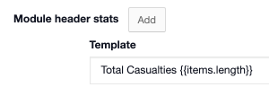

# Module Header Stats

#### WEB APP

Module header stats allow you to display the summed value of number fields as a header on a [status board](./). They also allow you to display the total figure for the number of rows entered. 



To do this go to the [Admin Area](../admin-area.md) and follow the steps below:

* Open up [Templates ](../templates/)and click edit on the status board you wish to edit
* As this only works with number fields you must have a number field on your status board template



* Scroll to the bottom of the page and click ➕ **Advanced Options**
* Here you will see **Module header stats**



* Click **Add**
* In this example I want to display the summed value for both **Shelter Capacity** and **Shelter Occupancy** as a header on my status board
* You must use the Field IDs for this, the Field ID for **Shelter Capacity** is **shelter\_capacity** and the field name for **Shelter Occupancy** is **current\_occupancy**. You need to hover your mouse over the field and click the **More Options \[⋮\]** to view the ID



* To sum the total number for **Shelter Capacity**, enter the following in Template:

```text
Shelter Capacity: {{items | map:'data.shelter_capacity' | add}}
```

* Click **Add**
* To sum the total number for **Shelter Occupancy**, enter the following in Template: 

```text
Shelter Occupancy: {{items | map:'data.current_occupancy' | add}}
```

* This is what it should look like in your account 



* Click **save**

You can also display the total figure for the number of rows entered in a status board and it will appear as a header on your status board



* To do this enter the following code in Template:

```text
Total Casualties {{items.length}}
```

* Where **Total Casualties** is the name of the header that you want to appear on your status board


Another example:

* Total \# Infected if you had an Infections board. The code for this would be: Total \# Infected \[\[items.length\]\]


* This is what it should look like in your account



* Click **save**



\*\*\*\*

