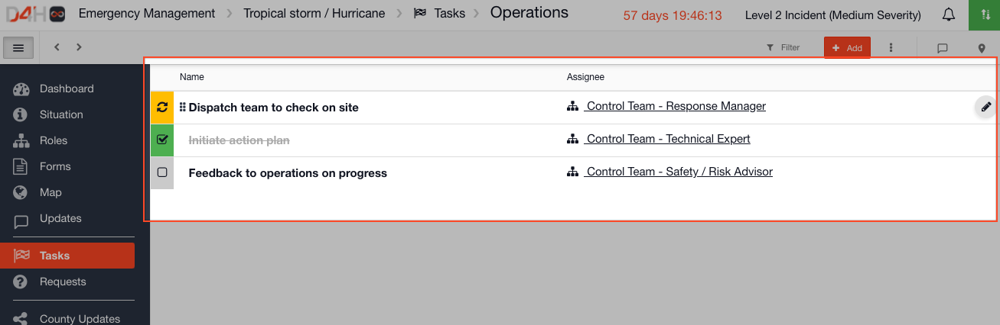

# Task Boards

Within [Incident Management ](getting-started.md)there are Task Boards which contain lists of tasks that get completed through a workflow. You can add as many task lists and tasks to a task board as you need. Behind each task \(row\) there is a form which can be configured in the [Admin Area](admin-area.md).


**Ideas for your Task Boards:**

* Immediate Actions
* Critical Services
* Requests
* Rescue Checklist
* Initial Response Tasklist
* EOC Tasks
* Search Assignments
* Security Tasks


## Task Board Templates

Each task board has a [Template](templates/) which outlines the layout of the form behind each task, and which columns should display on the list view of tasks.

* [Creating a new Task Board](https://support.d4h.org/incident-management-tasks/creating-a-new-task-board) 
* [Form Builder & Field Types](https://support.d4h.org/incident-management-forms/form-builder-and-field-types) 
* [List Layout Columns](https://support.d4h.org/incident-management-status-boards/how-do-i-edit-the-list-layout-view) 
* [Show or hide a form section based on the value of a field option](https://support.d4h.org/incident-management-templates/show-or-hide-a-form-section-based-on-the-value-of-a-field-option) 

## Task Board Collections

[Collections](https://support.d4h.org/incident-management-admin-area/collections) are used to pre-load data into a task board. For example you might have a task board of 'Checklists' and you could enter all the initial response tasks into the collections in advance. They are then available pre-loaded to be available to import during an actual incident.  
  

* [Creating Collections](https://support.d4h.org/incident-management-collections/creating-collections) 
* [Importing Collections into a Channel](https://support.d4h.org/incident-management-collections/importing-collections-into-a-channel) 
* [Including Collections in a Play](https://support.d4h.org/incident-management-plays/including-collections-in-a-play) 

## Using Task Boards

When you come to use a Task Board during an event or incident you should first add it to your channel, or start your channel with a [Play](https://support.d4h.org/incident-management-admin-area/plays) that includes it.

* [Adding a Task Board to a Channel](https://support.d4h.org/incident-management-tasks/adding-a-task-board-to-a-channel) 
* [Adding Tasks and Task Lists](https://support.d4h.org/incident-management-tasks/how-to-add-tasks-and-task-lists) 
* [Archiving Tasks](https://support.d4h.org/incident-management-tasks/archiving-tasks) 
* [Displaying Tasks on the Map](https://support.d4h.org/incident-management-tasks/displaying-tasks-on-the-map) 
* [Tagging Tasks in the Log](https://support.d4h.org/incident-management-tasks/tagging-tasks-in-the-log) 
* [Filtering a Taskboard](https://support.d4h.org/incident-management-tasks/filtering-a-taskboard) 
* [Filtering the Log to a Task](https://support.d4h.org/incident-management-tasks/filtering-the-log-to-a-task) 
* [Printing to PDF](https://support.d4h.org/incident-management-status-boards/printing-to-pdf) 
* [Sharing by Email and Public Link](https://support.d4h.org/incident-management-status-boards/sharing-by-email-and-link) 
* [Exporting To Spreadsheet](https://support.d4h.org/incident-management-status-boards/exporting-to-spreadsheet) 
* [Viewing the Audit Trail](https://support.d4h.org/incident-management-updates/viewing-the-audit-trail) 

