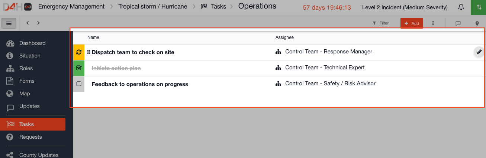

# Task Boards

Within [Incident Management ](../getting-started.md)there are Task Boards which contain lists of tasks that get completed through a workflow. You can add as many task lists and tasks to a task board as you need. Behind each task \(row\) there is a form which can be configured in the [Admin Area](../admin-area/).


**Ideas for your Task Boards:**

* Immediate Actions
* Critical Services
* Requests
* Rescue Checklist
* Initial Response Tasklist
* EOC Tasks
* Search Assignments
* Security Tasks


## Task Board Templates

Each task board has a [Template](../admin-area/templates/) which outlines the layout of the form behind each task, and which columns should display on the list view of tasks.









## Task Board Collections

[Collections](../admin-area/collections/) are used to pre-load data into a task board. For example you might have a task board of 'Checklists' and you could enter all the initial response tasks into the collections in advance. They are then available pre-loaded to be available to import during an actual incident.









## Using Task Boards

When you come to use a Task Board during an event or incident you should first add it to your channel, or start your channel with a [Play](../plays/) that includes it.























