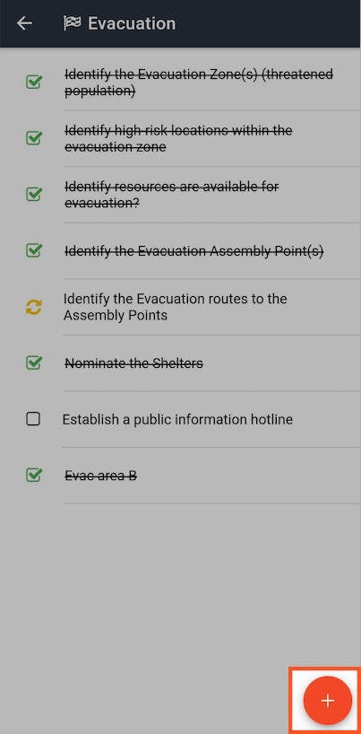
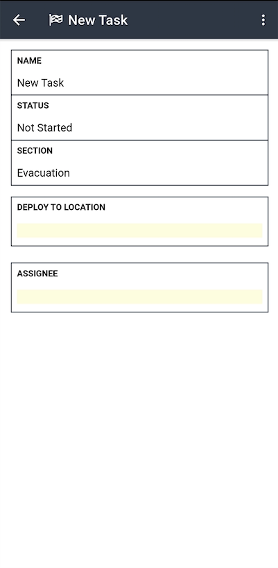

# Adding Tasks and Task Lists

To add tasks and task lists to a [Task Board ](./)within your channel.

* Click on the orange **Add** button and type in the name of the tasklist you want to create.
* Double click into the row and click on the red **Add** button
* Type in the task name
* Click on the **Add** button to create additional tasks within that list

#### WEB APP 



#### MOBILE APP 

  


Good task lists will relate to phases or responsibilities. This helps you see how each list is progressing to completion. 


  
Here are some examples of task lists and their respective tasks


**IMT Initial Deployment** 

* Confirm attendees
* Decide on equipment to travel
* Confirm fuel requirements
* Initiate notification to selected roles
* Deploy the Comms unit

**Operations** 

* Dispatch team to check on site
* Initiate action play
* Feedback to Operations on progress

**Chemical Spill** 

* Notify the highways agency
* Notify the roads department
* Check if emergency services needed
* Close road if applicable
* Update traffic signage to warn
* Contract clean service if required

**Evacuation** 

* Identify the Evacuation Zone\(s\)
* Identify high risk locations within the evacuation zone
* Identify resources are available for evacuation
* Identify the Evacuation Assembly Point\(s\)
* Identify the Evacuation routes to the Assembly Points
* Nominate the Shelters
* Establish a public information hotline

**Level A Donning Procedure \(Hazmat Team\)** 

* Fluid intake
* Entry and Back up Team seated
* Mission Briefing
* Suit Inspection
* SCBA Inspection
* Apply and Buff Anti Fog to all Visor Surfaces etc


