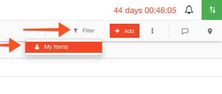

# Filtering a Taskboard

#### WEB APP

You can filter a task board so that it displays only the tasks that have been assigned to your role or to your team. In the [task board](./):

* Click the **filter** icon
* Click **My Items**
* Now only your tasks and your team's tasks are showing 



