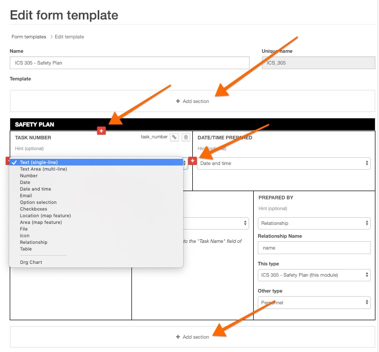

# Form Builder & Field Types

#### WEB APP

The form builder is used to create all form [templates](../) for all modules in your [Incident Management](../../getting-started.md) account. You can use the form builder to add new sections and new fields to your templates. 

## Adding Sections and Fields 

* To add a new section to a form click **+ Add section**
* If you want to give that section a heading, type it into the black bar
* Alternatively, you can leave this blank and it will appear as a page break in your form

* Then create the fields below. Additional fields can be created in all directions by selecting the orange + icon as well as additional sections by selecting the **+ Add section** icon.

## Field Types

* **Text \(single-line\):** this adds a single line text field to your template, to gather small snippets of information.

* **Text Area \(multi-line\):** this adds a multi-line text field to your template, to gather more detailed information.

* **Number:** this adds a number field to your template. You can add a Pre-symbol to the number e.g. $, € or a Post-symbol e.g. Km, °F, People



* **Date:** this adds a date field to your template. The system auto completes this field to the current date when you click into it or you can select a different date from the date picker. 

* **Date and time:** this adds and date and time field to your template. The system auto completes the date and time fields to the current date and time. If this field is completed on today's date, only the time will be displayed. Once the current date is in the past, the date will show on this field.  

* **Email:** this will add a single line text field where you can type in an email address. 

* **Option selection:** this adds an option selection field to your template. This is a drop down field with options that you have added to the field. You can set a default value in the drop down field. You can also allow for empty selection. Click the up and down arrows to the right of your options to rearrange the order in which they appear. 



* **Checkboxes:** this adds a checkbox field to your template. On your form you are able to check a box to make a selection. Click the up and down arrows to the right of your options to rearrange the order in which they appear.



* **Location \(map feature\):** this adds a location \(map feature\) to your template. This field is to record a specific address or location that you have searched for on the map.  

* **Area \(map feature\):** this adds an area \(map feature\) to your template. This field is to record a specific area on a map. You can use the drawing tools on the map to mark out the area. 



* **File:** this adds a file field to your template. This field allows you to upload a file to your form. You can select 'Allow to attach multiple files' if you want to be able to upload more than one file to that particular field.  

* **Icon:** this adds an icon field to your form. You can select an icon from a menu and it will display in this field.  

* **Relationship:** this adds a relationship field to your template. This field allows you to link data between different modules. 


[Roles](../../../personnel-and-training/roles/) are often linked to an Assignee field on the [Tasks](../../task-boards.md) form. By doing this, when someone who has been assigned a role goes to the Tasks module, they are able to filter the tasks list to My Items. This will display only tasks assigned to their role.




* **Table:** this adds a table field to your template. You can add columns to the table, each column can be a different field type. You can specify what column you want to sort the table by and what direction i.e. ascending or descending. 


It is possible to populate a table field with the contents of a [status board](../../status-boards/), [task board](../../task-boards.md), [personnel](../../personnel.md), or [roles](../../../personnel-and-training/roles/). 




* **Signature:** This adds a field for an electronic signature to your forms. This will allow you to sign status boards, tasks, and forms from both the web and mobile applications. Signing a form will `Lock` it from future edits.


You have the option draw, auto generate or upload a signature. 

**Automatic Signature Generator**

If you don't want to draw, we'll generate an automatic signature for you in a handwritten script.

**Uploading Your Signature**

If you have a photo of your signature, you can upload it as your default one. Single-click sign and lock forms from here.

**Locking A Form**

Signing a form will Lock it. This means that it is uneditable by you or other users. Whoever signed the form, approved it. Unlocking a form will erase all signatures on the form. Unlock a form from the context menu.


* **Org Chart:** This adds an organization chart field to your template. This pulls the Org chart from the [Roles](https://support.d4h.org/incident-management-teams-roles/roles2) module. You have to have the Org chart created here first or it won't appear when you add the field to your template. 



  

