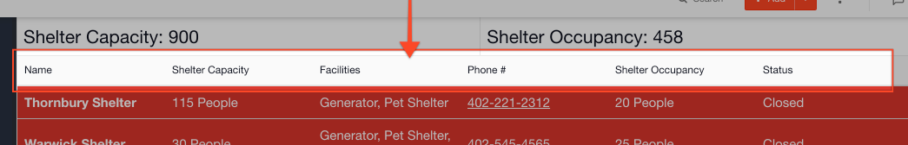

# List Layout Columns

#### WEB APP

The header row of columns that appears along the top of your [Status Board](../status-boards.md) or [Task Board](../task-boards.md) on their list view can be modified.

To edit the list layout columns open the [Admin Area](../admin-area.md):

* Open templates and click **Edit** on the relevant template
* Scroll to the bottom to **List Layout Columns**
* Here you can add or remove fields to the list view
* Drag & drop fields to re-order the columns



  

