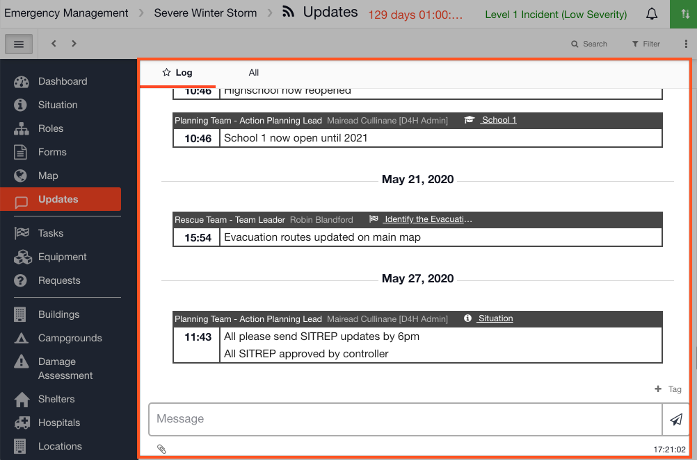

# Updates

Updates is where you will find your chronological log of all posts during an event / incident. It is also where you will find the audit trail showing all changes made in an open channel which are date and time stamped. \
\
At present, it is not possible to tag or filter Updates in the mobile app.\

## Using Updates


[filtering-the-log-to-an-item.md](filtering-the-log-to-an-item.md)



[filtering-the-log-to-a-role.md](../roles/filtering-the-log-to-a-role.md)



[filtering-the-log-to-a-task.md](filtering-the-log-to-a-task.md)



[tagging-items-in-the-log.md](tagging-items-in-the-log.md)



[tagging-a-role-in-the-log.md](../roles/tagging-a-role-in-the-log.md)



[tagging-tasks-in-the-log.md](tagging-tasks-in-the-log.md)



[tagging-the-situation-in-the-log.md](../situation/tagging-the-situation-in-the-log.md)



[tagging-one-of-your-personnel-in-the-log.md](tagging-one-of-your-personnel-in-the-log.md)



[viewing-the-audit-trail.md](../situation/viewing-the-audit-trail.md)



[printing-to-pdf.md](../situation/printing-to-pdf.md)

