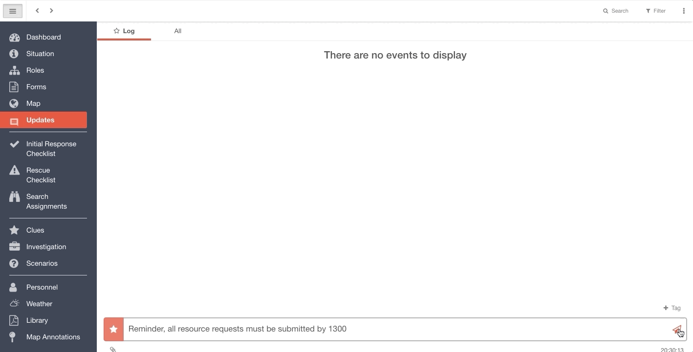

# Creating an Announcement

You can 'upgrade' a log post to an announcement that will be displayed prominently at the top of the window and emailed to everyone. You can do this in both channels and the [Control Room](../control-room/).  
  
To create an announcement, first post an update in the log then roll-over the post and select the bull-horn icon.  
  
The announcement will be displayed at the top of the channel until cleared. 


The header bar shows the most recent announcement only and clearing it only clear it for you. 


