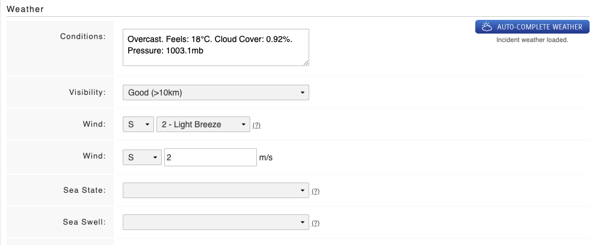

# Adding Weather to an Incident Report

On the basic tab of the incident, scroll to the bottom of the page:

* Click **Auto-Complete Weather**
* The weather fields that you have turned on will auto populate 

