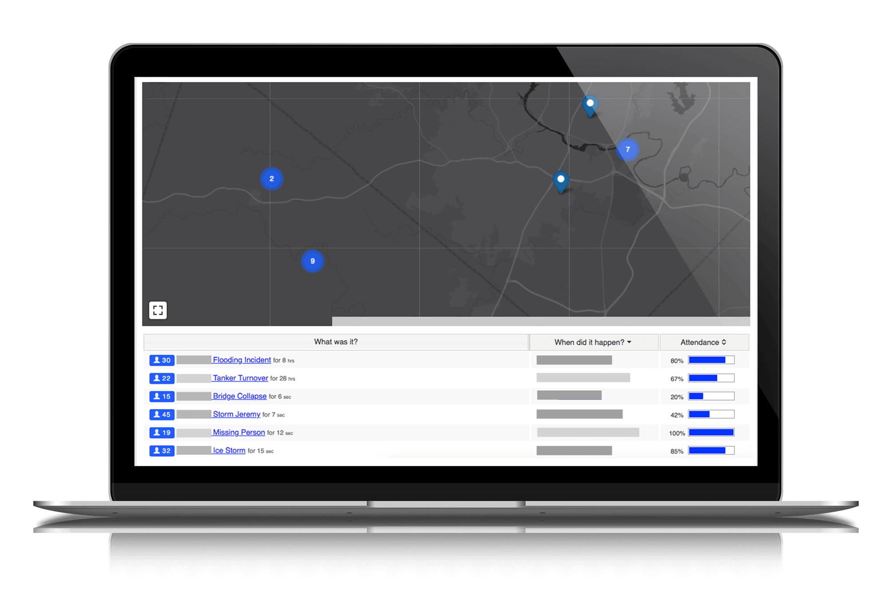

# D4H Incident Reporting Guide

[D4H Incident Reporting](https://d4htechnologies.com/incident-reporting) is our re-evaluation software which allows you to automatically generate insightful incident reports with charts, visualizations, and statistics. 

**Getting Started Guide**































