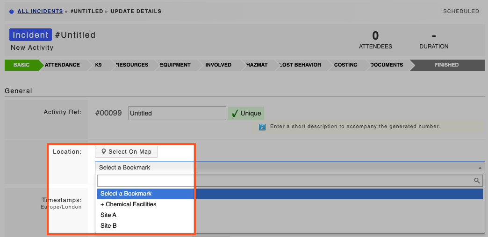

# Location Bookmarks

**Permission level required: Owner**  
  
Location bookmarks allow you to add your commonly used locations to the system so that you can easily and quickly select an address from a drop down field when creating an activity.

To add location bookmarks:

* Go to **Settings**
* At the bottom of the page under **Maps** select **Location Bookmarks**
* Click **Add Location**
* Give the location a title
* Select the address on the map by entering the address, coordinates, or moving the pin on the map 

* Click **Save Changes**
* Your bookmark will now appear in the location drop down when you open a new activity 

