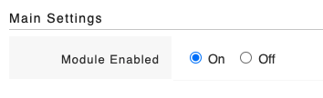

# Turning on the Persons Involved module

**Access Level Required: Owner**

To turn on the persons involved module:

* Go to **Settings** and under **Modules** select Persons Involved
* Select **ON** or **OFF**

