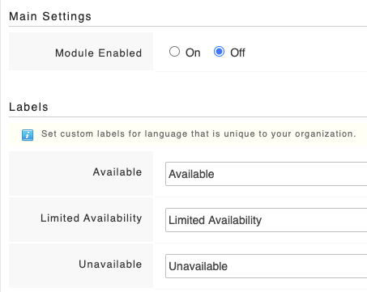

# Enabling the Availability module

To enable the availability module:

* Go to  **Settings** -&gt; **Team Status**
* Ensure **Module Enabled** is switched to **On**
* You can set your own custom labels here too
* At the bottom of the page, click **Save Changes**

