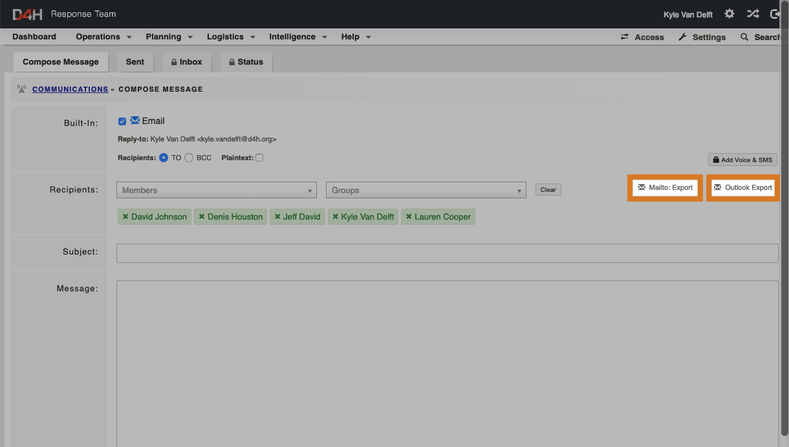

# Sending an email with an attachment

There is no facility to attach files when emailing directly from the communications module. However, there is a method using your own email client.

* After you have selected your recipients, click **Mailto: Expor**
* This will open your default email client with all the recipient addresses already inserted
* You can then attach files as you normally would in your email 

