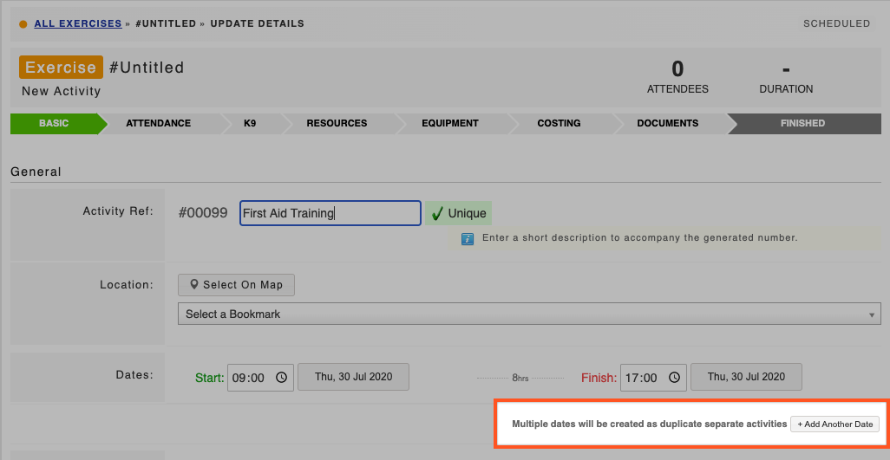

# Duplicating Activities

**Access Level Required: Owner, Editor.**  
  
You can easily add multiple dates for an Exercise or Event when it is initially created:

* Go to the **Dates** section on the basic tab
*  Here you will see **+Add Another Date** button which creates multiple dates as duplicate separate activities


This is useful for adding recurring exercises


