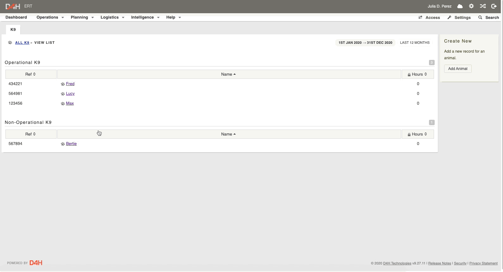

# Adding a Handler to a K9

To add a K9 to a Handler: 

* Click into the K9
* Click **Update handlers**
* Click the check box next to the handlers you want to assign to the K9
* Click **Update handlers**

