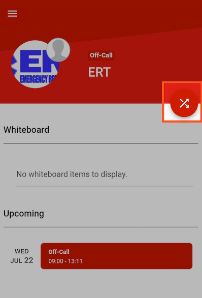
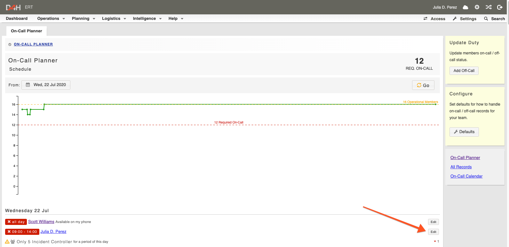

# On-Call Planner

Your personnel can mark themselves on-call and off-call through our mobile app or through the web application. The on-call planner helps you to monitor available resources day-by-day and set required levels of [personnel](https://support.d4h.org/d4h-personnel-training2/personnel-training) or [qualifications](https://support.d4h.org/d4h-personnel-training2/qualifications) to ensure the right complement of skills are always available on-call and ready to respond.  

#### WEB APP

  
The default setting in your account will be Off-Call. To change this to on-call:

* Go to Operations and On-Call Planner
* Select **Defaults**
* Change the **Default Status** to On-Call
* Click **Save Changes** at the bottom of the page 

## Updating your on/off call period 

There are two ways to update your on/off call period in the web application:

* Select the **+Add On-Call** or **+Add Off-Call** button from the dashboard. The button will depend on what default is set in your teams account
* From here you can fill in the date, duration, repetition and further details of your on / off call period
* Select yourself from the Personnel drop down menu
* Click **Save Changes** 

  
Or

* Go to Operations -&gt; On-Call Planner
* Select the **Add On-Call** or **Add Off-Call** button and follow the steps above 

## Viewing my on/off-call periods

* Go to Planning -&gt; Calendar
* Your on-call periods are shown in green and your off-call periods are shown in re
* Click into them to see the detail 

#### MOBILE APP 

* Click the 🔀 button which brings you to the availability screen where you can update your on/off call period 

## Editing an off-call period 

To edit or delete your on/off call:

* Go to the On-Call Planner
* Locate the period you wish to delete and click **Edit**
* From here you can edit the date/time of your on/off call perio
* If you wish to delete it, scroll to the bottom of the page and click the red **Delete** button.

## Setting the number of members required on-call 

The threshold of members required to be on call at any time can be set from the On-Call Planner:

* Select On Call Planner from the Operations drop down menu
* Click **Defaults** on the right hand side
* Update the required member threshold in the **Required** drop down menu at the top of the page

  
You will see a notification on the Dashboard as your team’s number of off-call members nears and surpasses the set threshold.

