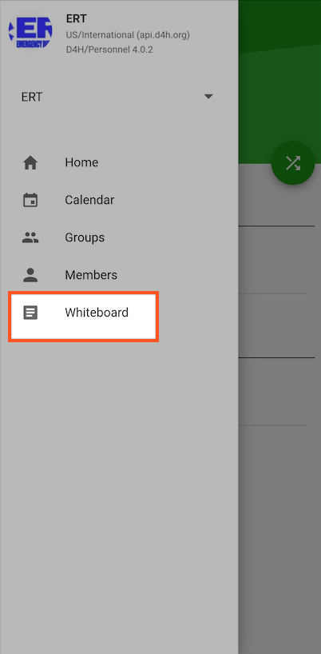

# Adding a note to the Whiteboard

### WEB APP

To add a note to the [whiteboard](./):

* Click **+Add Note** on the dashboard or go to Logistics -&gt; Whiteboard
* You can select the messages priority, if **important** is selected the message will appear in red text on the whiteboard
* Fill in the details and click **Write Note**

### **MOBILE APP** 

* Click on More Optionsto access the whiteboard 

