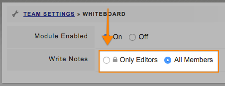

# Controlling who can write on the Whiteboard

**Access Level Required: Owner**

* Go to **Settings** -&gt; **Whiteboard**
* Set the **Write Notes** option to **Only Editors** 

* This will hide the **+ Add Note** button to Members and Member+

