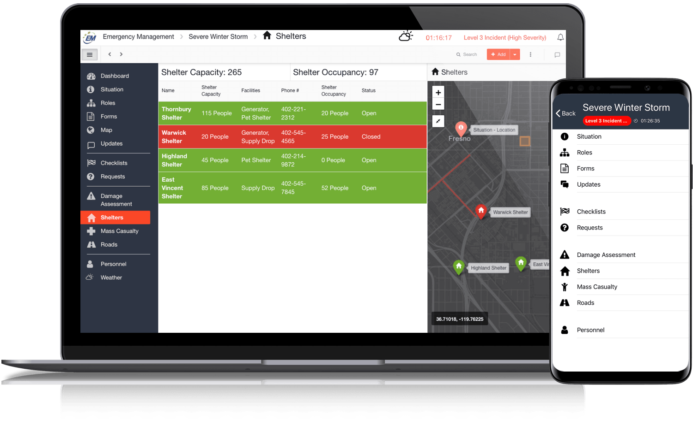

# Incident Management

  
  
[D4H Incident Management](http://d4htechnologies.com/incident-management) is our real-time platform for managing an incident or event in real-time.  
  
  
**Getting Started Guide**  
  

1. [Channels](https://support.d4h.org/incident-management-channels/channels) 
2. [Dashboard](https://support.d4h.org/incident-management-dashboard/dashboard) 
3. [Situation](https://support.d4h.org/incident-management-situation/situation) 
4. [Roles](https://support.d4h.org/incident-management-teams-roles/roles2) 
5. [Forms](https://support.d4h.org/incident-management-forms/forms) 
6. [Map](https://support.d4h.org/incident-management-maps/map) 
7. [Updates](https://support.d4h.org/incident-management-updates/updates) 
8. [Status Boards](https://support.d4h.org/incident-management-status-boards/status-boards) 
9. [Task Boards](https://support.d4h.org/incident-management-tasks/task-boards) 
10. [Personnel](https://support.d4h.org/incident-management-personnel/personnel) 
11. [Library](https://support.d4h.org/incident-management-library/library) 
12. [Mass Notifications](https://support.d4h.org/incident-management-mass-notifications/mass-notifications2) 
13. [Weather](https://support.d4h.org/incident-management-weather/weather) 
14. [Integrations](https://support.d4h.org/d4h-incident-management/integrations) 
15. [Admin Area](https://support.d4h.org/incident-management-admin-area/admin-area) 
16. [Incident Management Mobile App](https://d4htechnologies.com/resources/mobile-apps)


**Interested in upgrading or purchasing?** If you're interested in further information, please see our[ product page](https://d4htechnologies.com/incident-management) 


