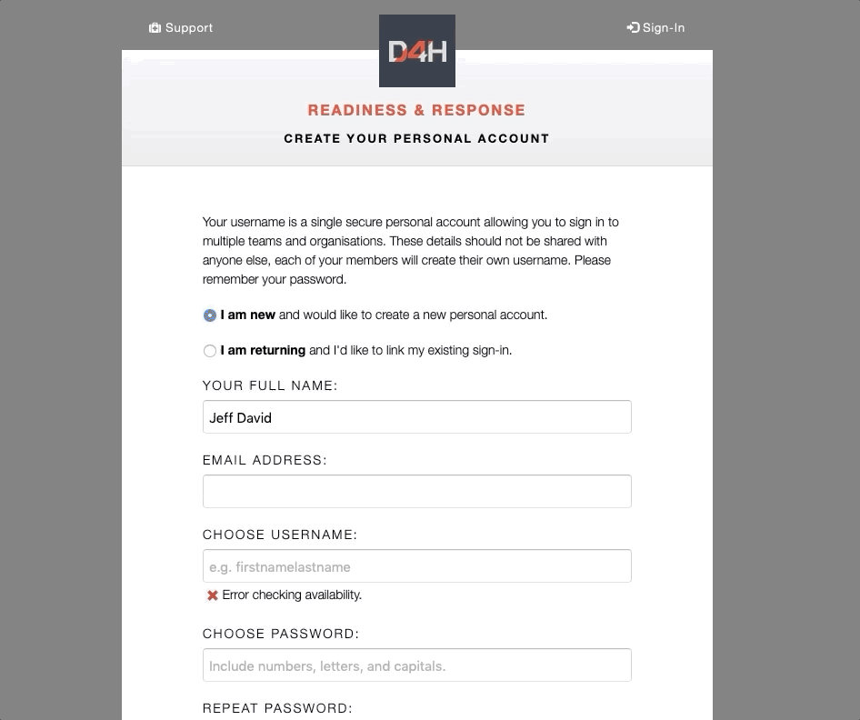

# Setting up a single sign-in for multiple accounts

**Access Level Required: Owner, Editor, Member**


This article applies to the products D4H [Personnel & Training](../../personnel-and-training/getting-started.md), [Equipment Management](../../equipment-management/getting-started.md), and [Incident Reporting](../../incident-reporting/getting-started.md). 


If you are a member of multiple teams, you can merge them to a single sign in.

* Sign into the account you wish to keep the sign in for
* Click on the **D4H logo** at the top left of the dashboard
* This will take you to a screen that allows you to have a single sign in for multiple accounts. Select the **Merge Accounts** icon near your username then follow the instructions
* Signing in will become a whole lot easier! - Just click the **D4H logo** when you wish to change account

To log in using your single sign in, use any one of your team's URL's or use the generic URL that matches the server your team is on:

  
[https://go.d4h.org](https://go.d4h.org/)   
[https://go.ca.d4h.org](https://go.ca.d4h.org/)   
[https://go.eu.d4h.org](https://go.eu.d4h.org/)   
[https://go.nz.d4h.org](https://go.nz.d4h.org/)  
[https://go.ap.d4h.org](https://go.ap.d4h.org/) 


It will not be possible toe merge your accounts if they are on different servers


