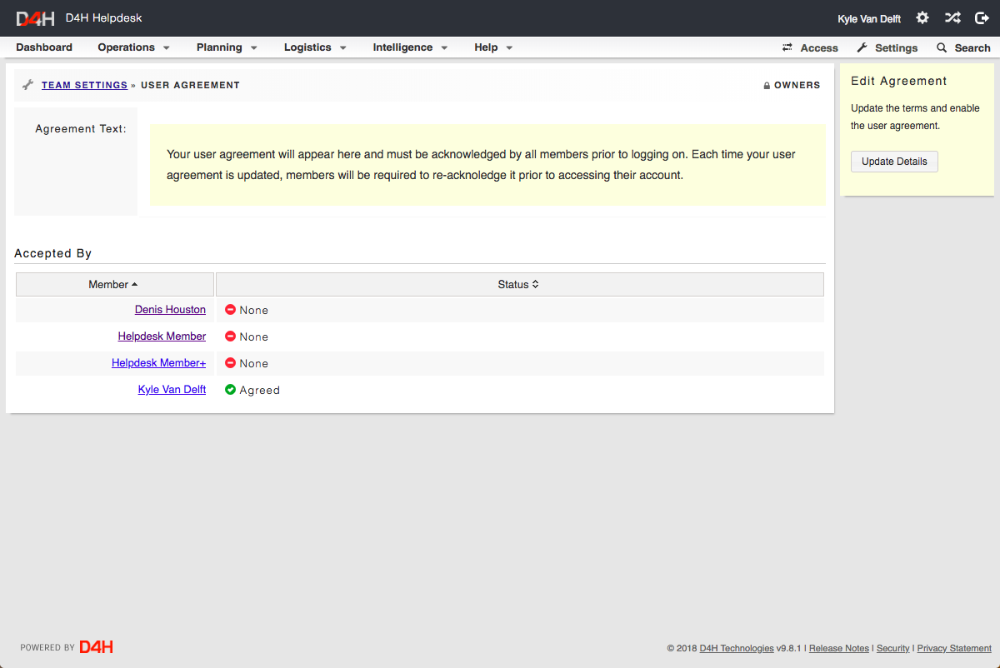

# Setting up a User Agreement

To set up a new user agreement for your account:

* Go to Settings  in the top right hand side of your account
* Under **Modules** select **User Agreement**
* Select **Update Details** and switch ****Enabled ****from off to on. You can then type your agreement into the text box. 
* After you save the changes, it will list all members and show who has and has accepted the terms

You can read more about protecting personal information on our blog here: [https://d4htechnologies.com/blog/20180514-a-guide-to-protecting-personal-information-for-response-teams](https://d4htechnologies.com/blog/20180514-a-guide-to-protecting-personal-information-for-response-teams)   
  

