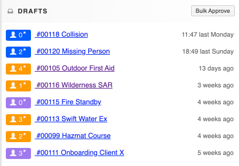

# Creating a new Activity (Incident / Exercise / Event)

[Incidents](../../incident-reporting/incident-reports.md), [Exercises and Events](../../personnel-and-training/exercises-and-events/) are all called activities within D4H. \
\
To create a new activity:

* From the dashboard select **+Add Incident** / **+Add Exercise** / **+Add Event**
* Fill out the details and click through the tabs across the top of the activity, clicking on finished at the end

Or

* Go to **Operations** -> select either **Incidents**, **Exercises** or **Events**
* Select the **Add Incident**, **Add Exercise** or **Add Event** button on the right hand side of the screen


**Tips**&#x20;

* You can add [custom fields](../custom-fields/) to your activity forms to capture further information
* Statistics from activities are not added to reports until the activity has been [approved](approving-an-activity.md). **Note** draft reports are displayed with an asterisk


## Basic

On the basic tab of an activity you will be entering the main data relating to the activity, such as location, time of activity and a description. \
Your activities will be assigned a unique reference number, enabling you to easily locate and manage them.

* Add [location bookmarks](../../incident-reporting/location-bookmarks.md) to quickly and easily set the location on an activity
* If you have added [tags](../tags/) to your account you will be able to select them at the bottom of the basic page

### Attendance Type

The attendance type field allows you to specify whether or not you want all team members to be invited to the activity

* Selecting Full-Team Incident invites all team members to the activity. New team members will automatically be invited to future full-team activities
* Selective-Team Incident means you can choose who to invite to the activity. You will be able to do this on the Attendance tab
* To set the default for this field go to  **Settings**
  * Under **Modules** select **Attendance**
  * Set your preference under the **Defaults** section

## Attendance

On the attendance tab you will be able to select who should be added to the activity.

* You can [set individual and multi-period attendances](setting-attendance-periods-on-an-activity.md) for members on an activity and [assign roles](../../personnel-and-training/roles/)

## K9

Here you will be able to add the[ K9](../../personnel-and-training/k9-and-handlers/) that attended the activity, assuming you have first added the [handler](../../personnel-and-training/k9-and-handlers/adding-k9-and-handlers-to-an-activity.md) in the attendance tab.

## Resources

On the [resources](../resources/) tab you will be able to record what external agencies / teams attended the activity.&#x20;

* Adding a resource to an activity: \

## Equipment

On the [equipment](../../equipment-management/getting-started.md) tab you will be able to [track equipment usage](track-equipment-usage.md).

## Involved (incidents only)

Here you can record details regarding the [persons involved](../../incident-reporting/persons-involved/) in the incident.&#x20;

## Hazmat (incidents only)

Record [hazardous materials](../../incident-reporting/hazardous-materials.md) data relating to the incident here.

## Lost Behavior (incidents only)

Record [lost person behavior](../../incident-reporting/lost-person-behavior/) here in order to export all lost person behavior statistics for submission to the international databases.

## Costing

Here you can edit the [costing](../cost-recovery/) for personnel and equipment if you do not want to apply the defaults that may already be set in your account.&#x20;

## Documents

Here you can upload relevant [documents](../documents/).&#x20;

## Finished

By clicking on the finished tab, your activity will be saved as a draft activity report. Only someone with Editor or Owner [permission levels](../../user-access/permissions.md) will be able to approve the report. \
