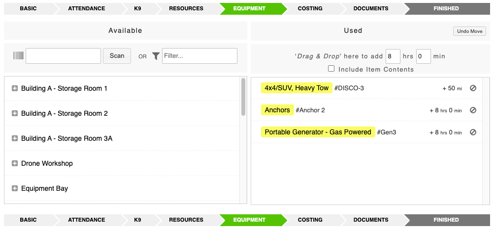
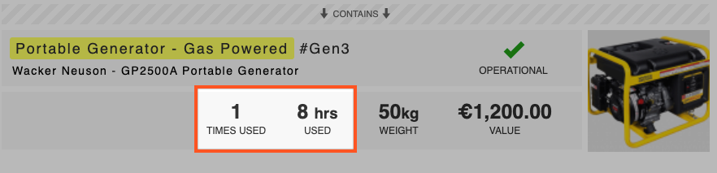

# Track Equipment Usage

When adding or editing an activity, you will be able to track the equipment used on the activity. You can do this from the [Equipment](https://support.d4h.org/d4h-equipment-management/equipment-management) tab highlighted below in green:

**To select items as used:**

* Drag & Drop items from the left side to the right side with your mouse
* Or place the cursor in the barcode entry box and use an attached barcode scanner to select items automatically
* Once moved to the right side you can click to edit the number of hours, items used, or add mileage for each item


**Tips:**

* Use the filter box on the left to filter the results to quickly find what you need
* Change the amount of hours on the right side before you drag & drop to pre-set them for everything
* Tick 'Include Contents' on the right side to also bulk-add all the contents of the item, e.g. a vehicle where everything stored in the vehicle was used on the activity


* Click finished on the [activity](./) report to save it and then approve it
* Now the usage will appear on the items of equipment
* Click on the **Times Used** to open a list of all activities it was used on

* If a disposable piece of equipment was used on an activity, the quantity of this item will now be reduced by the quantity used on the activity
* You can also view how many time**s** the supply was used and on what activity by going directly to the item

