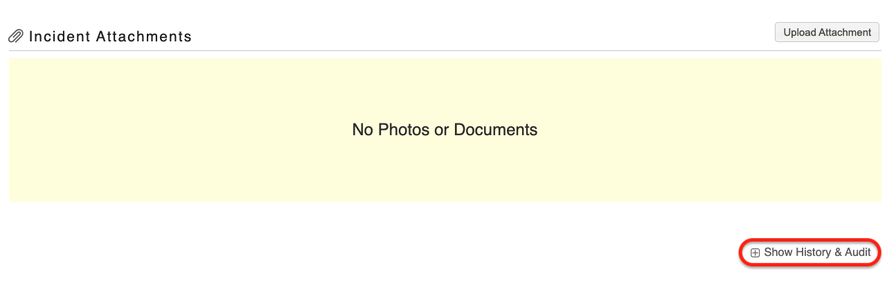

# Viewing the Audit History of an Activity

**Access Level Required: Owner, Editor.**

To view the audit history of an activity:

* Scroll to the bottom of the activity
* Here you will see a link **+Show History & Audit**, click this
* This will give you date and timestamped details about who made changes on that specific activity

