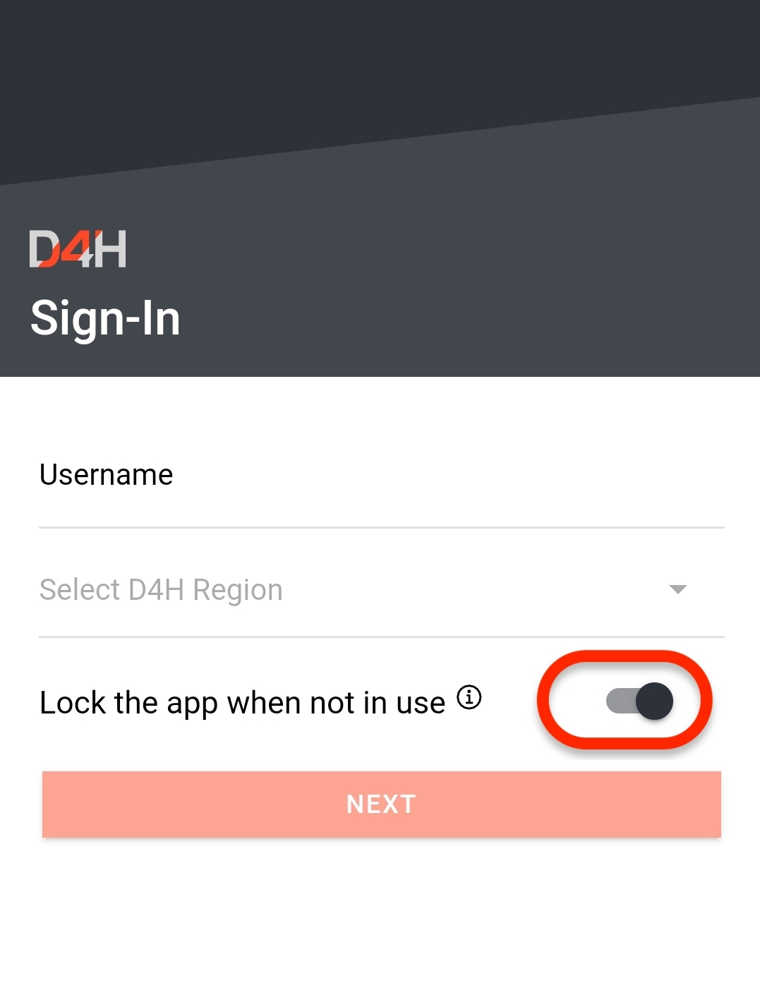

# Biometric Authentication

All of our [D4H apps](https://d4htechnologies.com/resources/mobile-apps) allow for the use of Biometric Authentication. This means you can chose to use your FaceID \(facial recognition\) or TouchID \(fingerprint\) to verify your identity. Unlocking the app in this way not only verifies it is you using your device in-person but also un-encrypts your credentials to communicate with D4H when sending or receiving information.  
  
If you switch to another app, we will lock the screen of the app so nobody can see an old screen in your task manager, and make it unable to switch back without re-validating by biometric authentication.  
  
If biometric sensors are unavailable the app will revert to a PIN. If you fail more than 3 times to biometrically authenticate the system will ask for your PIN. If you lock yourself out, you can sign-out and back in to re-encrypt your credentials.  
  
To turn off Biometric Authentication

* Sign out of the D4H app you are using
* Toggle the 'Lock the app when not in use' button to **Off**
* Sign back in as you would normally 

