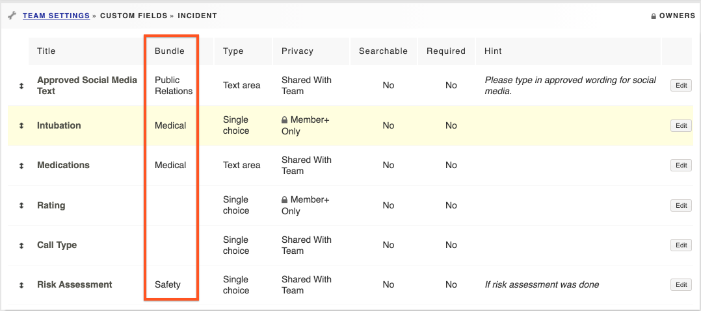

# Custom Field Bundles

When creating bundles in [custom fields](../custom-fields/), the bundle will be the section header on the activity report. Use the same bundle for custom fields that you want to group together. To create a new custom field bundle, simply put your cursor in the 'Bundle' drop down field when you create the new field and type the name you want the bundle to have. It will add it as a new bundle once you click save changes at the bottom of the screen. If you leave the bundle field blank, your custom field will appear under a section called 'Custom Fields'.

Note the bundles highlighted on an activity report below:

  
  
  

