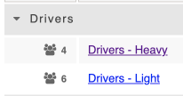
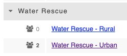
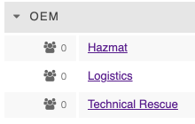

# Group Bundles \(Personnel & Training\)

The bundle field is to help organize similar [groups](../../personnel-and-training/groups/) together. It makes it easier to view your groups when navigating to this page in D4H. 

To create a new group bundle, simply put your cursor in the 'Bundle' drop down field when you create the new group and type the name you want the bundle to have. It will add it as a new group once you click save changes at the bottom of the screen. If you leave the bundle field blank, your new group will appear under a section titled 'Others'.

