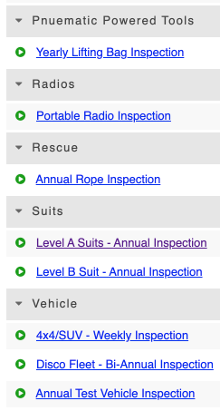

# Inspection bundles \(Equipment Management\)

You can add your [inspections](../../equipment-management/inspections/) to a bundle to group inspections together. Note, you can bundle all Vehicle related inspections under a 'Vehicle' bundle for example. 

To create a new inspection bundle, simply put your cursor in the 'Bundle' drop down field when you create the new inspection and type the name you want the bundle to have. It will add it as a new bundle once you click save changes at the bottom of the screen. If you leave the bundle field blank, your new inspection will appear at the top of the inspection list without any bundle information.  
  

