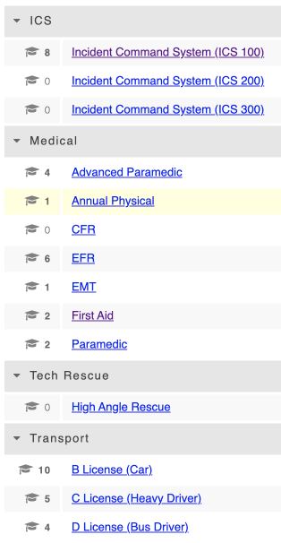

# Qualification Bundles \(Personnel & Training\)

The bundle field is to help organize similar [qualifications](../../personnel-and-training/qualifications/) together. Any unbundled qualifications will appear under a header titled 'Others'. 

To create a new qualifications bundle, simply put your cursor in the 'Bundle' drop down field when you create the new qualification and type the name you want the bundle to have. It will add it as a new bundle once you click save changes at the bottom of the screen.   
  

