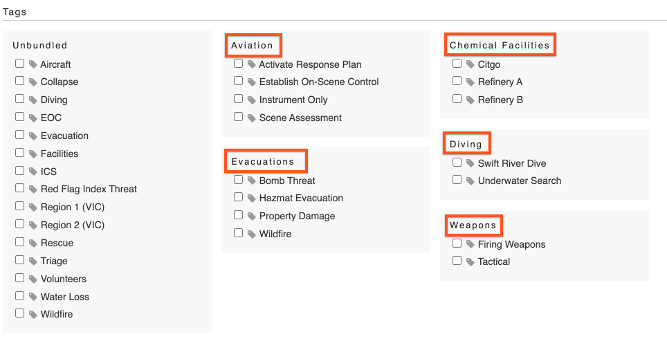

# Tag Bundles

Use bundles to help organize similar [tags](../tags/) together. 

| **Bundle**  | **Tags in that bundle**  |
| :--- | :--- |
|  Training  |  Basic Training  |
|  |  Mandatory Training  |
|  Diving  |  Swift Water Dive  |
|  |  Underwater Search  |
|  Evacuations  |  Bomb Threat  |
|  |  Hazmat Evacuation  |
|  |  Wildfire  |
|  Weapons  |  Firing Weapon  |
|  |  Tactical  |

The bundle will be the title header of your tags when you view them on an activity, the bundles are highlighted in the example below:

To create a new tag bundle, click the 'Create Bundle' button on the right hand side of the Tags page. There will be an option to chose a bundle when you create a tag, but you can also go back and update a tag's bundle whenever you need. If you do not select a bundle for a tag, it will appear in a section titled 'Unbundled'.

