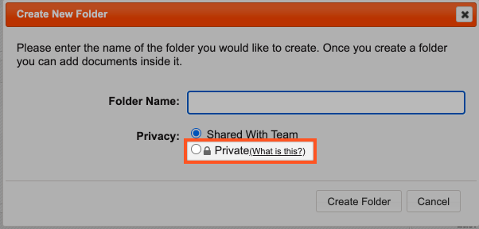

# Creating a Folder

To create a new folder:

* Go to **Intelligence** -&gt; **Documents**
* Click **Add Folder**
* You can set the folder as 'Shared With Team' or 'Private'
* Click Create Folder


It is not possible to create sub folders 


A private folder is only visible to Member+ and above. All files in the private folder are only visible to Member+ and above.

* When you click **Add Folder**, you have the option to make the folder **Private** 

* To convert an existing folder to private, click **Update Details** on the folder and select **Private** 

