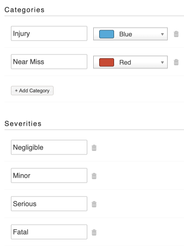

# Configuring the Categories and Severities

To configure the categories and severities for Health & Safety reports:

* Go to   Settings 
* Under **Modules** click into Health & Safety
* Here you can add in the categories and severities you want to use for your health and safety reports 

