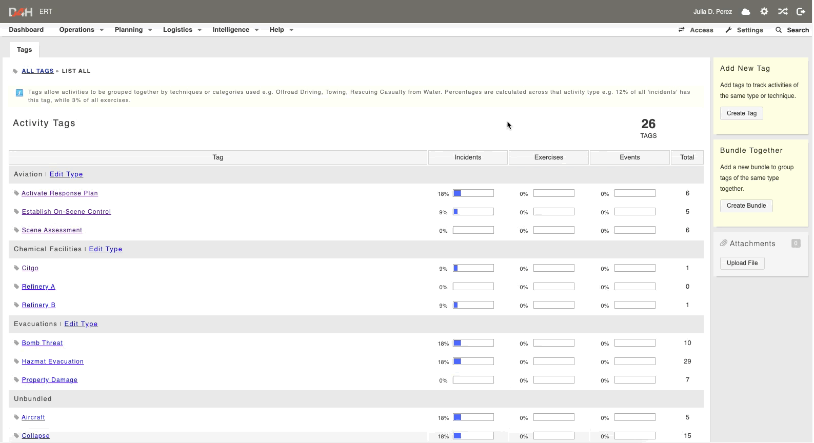

# Adding new tags

To add new tags:

* Go to **Intelligence** -&gt; **Tags**
* Click **Create Tag** on the right-hand side of the page
* Enter the details and click **Save Changes**
* You can also create [bundles](../bundles/) to help organize similar tags together by selecting **Create Bundle**


**Examples of tags and bundles:**

|  **Bundle**  |  **Tag**  |
| :--- | :--- |
|  Location Features  |  Coastal  |
|  |  Highway/Freeway  |
|  |  Lakes  |
|  |  Mountains/Hills  |
|  Medical  |  CPR  |
|  |  Fire Aid  |
|  |  Spinal Board  |
|  Fire  |  45mm Hose  |
|  |  Breathing Apparatus  |
|  |  Fire Attack  |
|  |  Scaling Ladder  |


