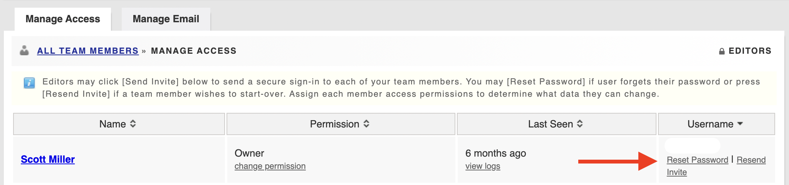

# Resetting Passwords


This article applies to the products D4H [Personnel & Training](../personnel-and-training/getting-started.md), [Equipment Management](../equipment-management/getting-started.md), and [Incident Reporting](../incident-reporting/getting-started.md). 


To reset the password for one of your members:

* Go to  **Access** 
* Scroll down to the name of the user your want to reset
* Select **Reset Password** from the username column 


If your member does not see the password reset email in their inbox, have them check their spam folder. 


